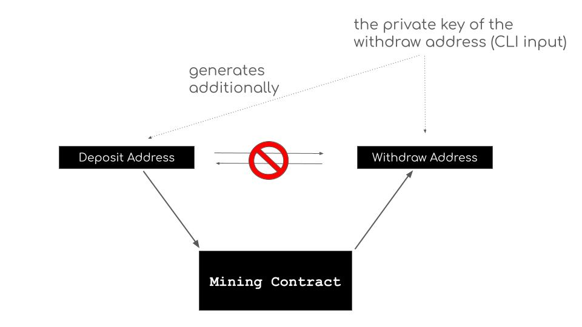

# mining-cli

A CLI tool for automatic mining of ITX tokens.

## Overview

mining-cli is a tool that allows users to mine ITX tokens by participating in a simplified version of Intmax2. By utilizing a simplified version of Intmax2 that focuses on deposit and private withdrawal functions, users can contribute to enhancing Ethereum's privacy while earning rewards in ITX tokens.

For more information on mining, please refer to [this article](https://hackmd.io/zNLtkMXXSCernbkTf1BTrQ).

### Minimum Requirements

- Memory: 8GB or more
- CPU: 4 cores or more, with a clock speed of 2 GHz or higher.
  _Note: Some Windows version might have issues while mining. Refer to this [guide](docs/windows.md) to fix it._

## Quick Links

You can find detailed information on how to use the CLI in the following documents:

### [Quick Start for Beginners - Base Mainnet](docs/mainnet-quickstart.md)
_Base Mainnet will be available from 19th Oct 00:00 UTC_

### [Quick Start for Beginners - Base Testnet](docs/quickstart.md)

### [How To Migrate From Ethereum Mainnet To Base](docs/migrate.md)

### [Detailed Documents](docs/developer.md)

### [Terms of Use](docs/terms.md)

## How It Works

<div align="center">
  
</div>

1. **Automated Deposits and Withdrawals**: The CLI automatically transfers funds from your deposit address into a simplified Intmax2 system. After a random delay, the funds are withdrawn to your withdrawal address. Through Zero-Knowledge Proofs , the relationship between your deposit and withdrawal addresses remains confidential.

2. **Reward Mechanism**: By participating in these private asset transfers, you contribute to enhancing Ethereum's privacy ecosystem. As a reward for your contribution, you earn ITX tokens. These tokens are distributed weekly to your withdrawal address, available every Monday at 00:00 UTC. Note that rewards are subject to a one-week delay. For instance, mining activities completed on a Sunday will be eligible for claiming not on the immediately following Monday, but on the Monday eight days later.

## About Pending Deposits

ETH enters a pending state immediately after deposit. The admin evaluates it according to AML criteria, and if there are no issues, it is deposited into the simplified intmax2. Deposits rejected by AML criteria are automatically refunded to the deposit address during mining. Pending deposits can be cancelled by running in exit mode.

## Status

During mining, a status message like the following will be displayed. This indicates the state of the deposit account:

```

Deposits: 3 (success: 2 pending: 1 rejected: 0 cancelled: 0) Withdrawn: 2 Eligible: 0 (claimed: 0)

```

The status message components are:

- Deposits: Total number of deposits
- Success: Number of successful deposits
- Pending: Number of deposits awaiting AML analysis
- Rejected: Number of deposits rejected by AML analysis
- Cancelled: Number of cancelled deposits
- Withdrawn: Number of withdrawals
- Eligible: Number of deposits eligible for ITX rewards
- Claimed: Number of deposits for which rewards have been claimed

## Important Notes

### AML Verification

Money deposited into the simplified version of Intmax2 undergoes AML (Anti-Money Laundering) verification. Deposits from suspicious addresses or those made through mixing services like Tornado Cash will be rejected.
You can recover rejected funds by launching the CLI in mining mode or exit mode.

### Token Eligibility

This mining is privacy mining, and addresses that compromise the privacy gained through mining **will be ineligible for mining rewards**.
Specifically, if there are direct or indirect transfers between deposit addresses and withdrawal addresses, the deposit address used for that mining will not be eligible for rewards. You can check whether an deposit address is eligible for rewards in the "Qualified" column after selecting the mode.

Here are examples of actions that would make an address **ineligible** for rewards:

- From a wallet A, deposit 1.01 ETH into deposit address #0, and a total of 0.98 ETH is withdrawn to the withdrawal address before mining ends. Then, send 0.98 ETH back to wallet A.

- Deposit 1.01 ETH into deposit address #0, and a total of 0.98 ETH is withdrawn to the withdrawal address before mining ends. Then, deposit this amount into deposit address #1 and mine again.

- Deposit 1.1 ETH into deposit address #0. After mining is completed, 0.09 ETH remains in deposit address #0, which is then sent to the withdrawal address.

<div align="center">
  
</div>

## FAQs

Q: Can I lose my mining funds?<br>
A: Your funds are safe as long as you don't lose your withdrawal private key.

Q: Is this process self-custodial?<br>
A: Yes, but the contract is currently upgradable. The intmax team plans to relinquish this ability soon.

Q: What are the costs associated with mining?<br>
A: Gas fees are incurred for each deposit, withdrawal, and claim. The gas fee for withdrawal is deducted from the withdrawn ETH.

Q: What actions will disqualify me from receiving ITX token rewards?<br>
A: Avoid actions that link your deposit and withdrawal addresses. For example, if you directly or indirectly transfer funds from your withdrawal address to your deposit address, you will not be eligible for ITX rewards. Also, using the funds in the withdrawal address for the next mining directly is considered a linking action.

Q: How do I stop the CLI?<br>
A: To stop the CLI, simply press Ctrl+C in the terminal where it's running. This will safely terminate the process. If there is a balance in intmax2, you can withdraw it by running in the exit mode.

Q: An error occurred during execution. What should I do?<br>
A: Feel free to run it again. It's designed to be safe for re-execution.
