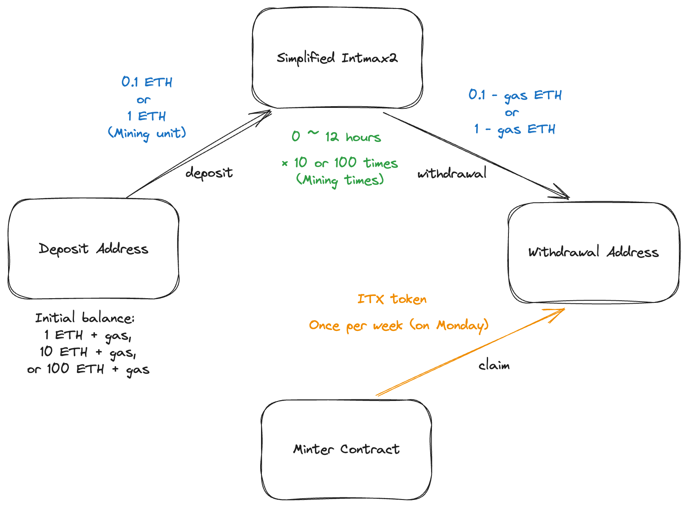

# v1-mining-cli

> **⚠️ Pre-release Sepolia Testnet Version**
>
> This CLI tool currently operates on Sepolia testnet only. Key differences from future Mainnet:
>
> - Mining: Every few minutes (Mainnet: hours)
> - Claims: Daily at 00:00 UTC, with a 1-day delay (Mainnet: weekly on Mondays at 00:00 UTC, with a 1-week delay)
> - Tokens: Test tokens (Mainnet: ITX tokens)
>
> "Mainnet" references below refer to Sepolia testnet in this version.

A CLI tool for automatic mining of ITX tokens.

## Overview

v1-mining-cli is a tool that allows users to mine ITX tokens by participating in a simplified version of intmax2. By utilizing a simplified version of intmax2 that focuses on deposit and private withdrawal functions, users can contribute to enhancing Ethereum's privacy while earning rewards in ITX tokens.

### Key Features

- Automated mining process (deposit and withdrawal)
- Weekly ITX token rewards

## Mining flow

<div align="center">
  
</div>

1. **Preparation**: You need two types of Ethereum addresses:

- **Deposit address**: Where you initially deposit ETH for mining
- **Withdrawal address**: Where deposited ETH is withdrawn to after subtraction of gas fees, and where you receive ITX token rewards

Additionally, you need a mainnet RPC URL. We strongly recommend using Alchemy's RPC (the free plan is sufficient). This is because it has a high limit for retrieving event logs. You can set these through environment variables. Please refer to the Operating Commands section below for more details.

1. **Mining Process**:

- The CLI automatically deposits smaller amounts (0.1 or 1 ETH) into intmax2. The deposit amount can be configured through environment variables.
- After a few hours, it withdraws these amounts to your withdrawal address.

3. **Rewards**:

- Receive ITX tokens weekly in your withdrawal address (available every Monday at 0:00 UTC. Rewards are delayed by one week. For example, mining done on a Sunday can be claimed not on the following Monday, but on the Monday 8 days later)
- Ensure your withdrawal address has enough ETH for claim gas fees

## System Requirements

### Minimum Requirements

- Memory: 12GB or more
- CPU: 4 cores or more, with a clock speed of 2 GHz or higher
- Storage: 10GB or more of free space

# Quick Start Guide

## Prerequisites

Before you begin, please ensure you have the following:

- **Ethereum (ETH)**: A minimum of 1 ETH plus additional ETH for deposit fees.
- **RPC URL**: We recommend using Alchemy's free plan. Sign up at [https://www.alchemy.com/](https://www.alchemy.com/)
- **Deposit Private Key**: The private key of the address you'll use to deposit ETH.
- **Withdrawal Private Key**: The private key of the address you'll use to withdraw ETH and receive ITX tokens.

## Installation and Setup

1. Navigate to the [Releases](https://github.com/InternetMaximalism/intmax2-mining-cli/releases) page of this repository.
2. Download the ZIP file appropriate for your operating system.
3. Extract the contents of the ZIP file to your desired location.

## Running the Application

1. Locate the extracted files and double-click on the executable file to launch the application.
2. Follow the CLI prompts to input the required information:

   - RPC URL
   - Deposit Private Key
   - Withdrawal Private Key
   - Other configuration options (as needed)

3. The application will guide you through the setup process and initiate the mining operation.

## Build from Source Code

### For Linux / Windows Subsystem for Linux (WSL)

1. Install required packages and Rust:

```bash
apt update && apt install -y git curl build-essential pkg-config libssl-dev
curl --proto '=https' --tlsv1.2 -sSf https://sh.rustup.rs | sh
source $HOME/.cargo/env
```

These commands should be run with sudo if necessary, depending on the execution environment.

2. Clone the repository in arbitrary directory and install the CLI:

```bash
git clone https://github.com/internetMaximalism/intmax2-mining-cli.git
cd intmax2-mining-cli
cargo install --path .
```

3. Run the CLI:

```bash
cd intmax2-mining-cli
mining-cli --version
```

### For Mac

1. Install Rust:

```bash
curl --proto '=https' --tlsv1.2 -sSf https://sh.rustup.rs | sh
```

1. Follow steps 2 and 3 from the Linux/WSL instructions.

## Updating the CLI

To update the v1-mining-cli to the latest version:

1. Navigate to the repository directory and pull the latest changes:

```bash
cd path/to/intmax2-mining-cli
git pull origin main
```

2. Rebuild and reinstall the CLI:

```bash
cargo install --path .
```

3. Restart the mining-cli if it's currently running.

## Operating Commands

The CLI can be operated interactively or run automatically by setting environment variables. Below is a list of environment variables required by the CLI.
Users utilizing the interactive mode do not need to set these environment variables.

### Environment Variables

| Name                     | Description                                                                                                                                                                     | Example                                             | Default Value |
| ------------------------ | ------------------------------------------------------------------------------------------------------------------------------------------------------------------------------- | --------------------------------------------------- | ------------- |
| `RPC_URL`                | Blockchain RPC URL. Alchemy's RPC is strongly recommended. Required.                                                                                                            | `https://eth-mainnet.alchemyapi.io/v2/YOUR-API-KEY` | None          |
| `MAX_GAS_PRICE`          | Maximum gas price in GWei allowed when executing transactions.                                                                                                                  | `30`                                                | `"30"`        |
| `MINING_UNIT`            | Amount of ETH per mining operation.                                                                                                                                             | `"0.1"` or `"1"`                                    | `"0.1"`       |
| `MINING_TIMES`           | Number of mining operations (sets of deposit and withdrawal).                                                                                                                   | `"10"` or `"100"`                                   | `"10"`        |
| `DEPOSIT_PRIVATE_KEYS`   | Array of private keys for deposit accounts. Each address must contain ETH equal to `MINING_UNIT * MINING_TIMES` plus gas fees for deposits. Required when `ENCRYPT` is `false`. | `'["0x123...", "0x456..."]'`                        | None          |
| `WITHDRAWAL_PRIVATE_KEY` | Private key of withdrawal address. Required when `ENCRYPT` is `false`.                                                                                                          | `"0x789..."`                                        | None          |
| `ENCRYPTED_KEYS`         | Encrypted form of deposit private keys and withdrawal private key. Required when `ENCRYPT` is `true`.                                                                           | `"encrypted_string_here"`                           | None          |

### Commands

1. `mining-cli mining`

   - Performs mining by repeatedly executing deposits and withdrawals.

2. `mining-cli claim`

   - Claims available ITX tokens.

3. `mining-cli exit`
   - Withdraws all balances currently in the simplified intmax2 and cancels pending deposits.

## About Pending Deposits

ETH enters a pending state immediately after deposit. The admin evaluates it according to AML criteria, and if there are no issues, it is deposited into the simplified intmax2. Deposits rejected by AML criteria are automatically refunded to the deposit address during mining. Pending deposits can be cancelled by running in exit mode.

## Status

During mining, a status message like the following will be displayed. This indicates the state of the deposit account:

```

Deposits: 3 (success: 2 pending: 1 rejected: 0 cancelled: 0) Withdrawn: 2 Eligible: 0 (claimed: 0)

```

The status message components are:

- Deposits: Total number of deposits
- Success: Number of successful deposits
- Pending: Number of deposits awaiting AML analysis
- Rejected: Number of deposits rejected by AML analysis
- Cancelled: Number of cancelled deposits
- Withdrawn: Number of withdrawals
- Eligible: Number of deposits eligible for ITX rewards
- Claimed: Number of deposits for which rewards have been claimed

## Important Notes

- **Privacy is crucial**: Avoid actions that link your deposit and withdrawal addresses. If you link your deposit and withdrawal addresses, you will not be eligible for ITX rewards.
- **Do not** directly transfer funds between your old withdrawal and new deposit addresses

## FAQs

Q: Can I lose my mining funds?<br>
A: Your funds are safe as long as you don't lose your deposit private key.

Q: Is this process self-custodial?<br>
A: Yes, but the contract is currently upgradable. The intmax team plans to relinquish this ability soon.

Q: What are the costs associated with mining?<br>
A: Gas fees are incurred for each deposit, withdrawal, and claim. The gas fee for withdrawal is deducted from the withdrawn ETH.

Q: How is the amount of ITX that can be mined determined?<br>
A: The amount of ITX that can be mined is proportional to the amount of ETH deposited. For example, if you deposit 0.1 ETH 10 times, you can earn the same amount of ITX as if you deposited 1 ETH. Also, the rewards for that day are determined based on the proportion of the ETH deposited that day to the ETH you deposited.

Q: What actions will disqualify me from receiving ITX token rewards?<br>
A: Avoid actions that link your deposit and withdrawal addresses. For example, if you directly or indirectly transfer funds from your withdrawal address to your deposit address, you will not be eligible for ITX rewards. Also, using the funds in the withdrawal address for the next mining directly is considered a linking action.

Q: How do I stop the CLI?<br>
A: To stop the CLI, simply press Ctrl+C in the terminal where it's running. This will safely terminate the process. If there is a balance in intmax2, you can withdraw it by running in the exit mode.

Q: An error occurred during execution. What should I do?<br>
A: Feel free to run it again. It's designed to be safe for re-execution.
