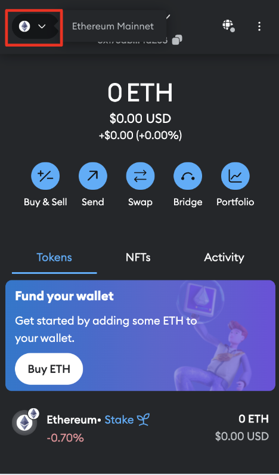
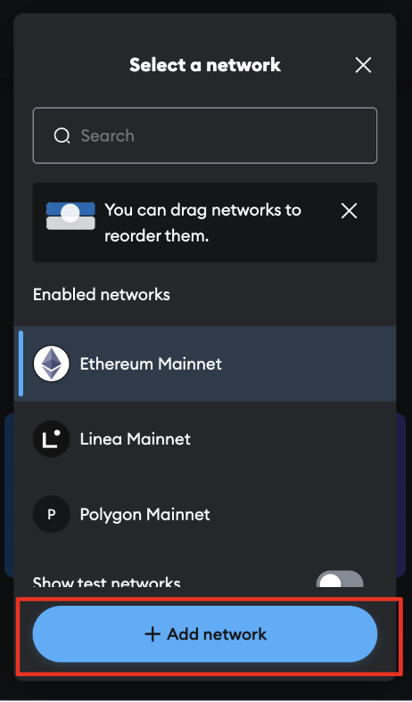
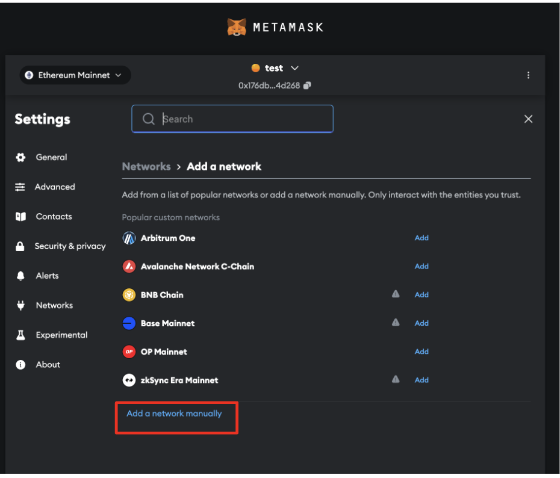
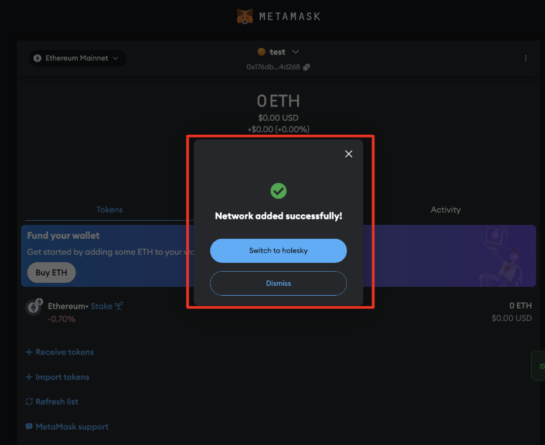
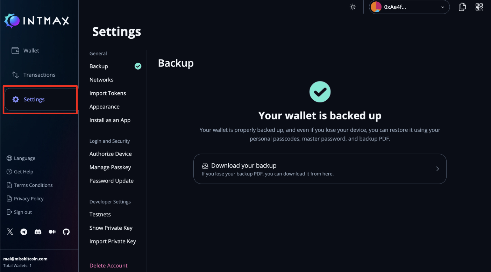
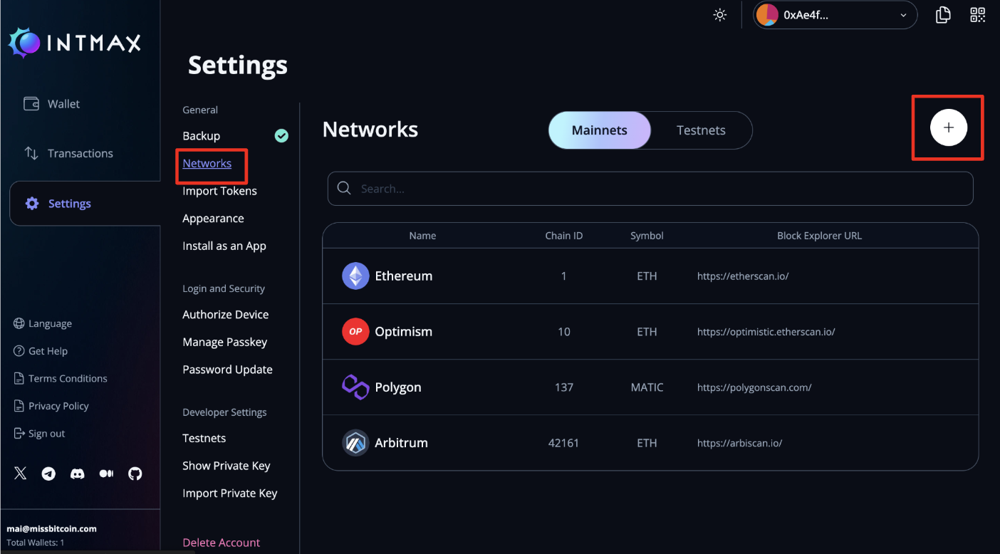

# How to Add ITX Token to Your Wallet

## Token Information

Token Name: `INTMAX`

Token Symbol: `ITX`

Decimals: `18`

| Network                           | Contract Address                                    |
| --------------------------------- | ------------------------------------------ |
| Ethereum Mainnet (Legacy)          | 0xe24e207c6156241cAfb41D025B3b5F0677114C81 |
| Base Sepolia                      | 0x2699CD7f883DecC464171a7A92f4CcC4eF220fa2 |
| Old Base Mainnet                  | 0x58f434698571346f77Bc755cfDC89c5708E7b184 |
| New Base Mainnet (From 18/01/2025) | 0xf95117e3a5B7968703CeD3B66A9CbE0Bc9e1D8bf |
 

### Quick Links

- [Import ITX token to MetaMask](#import-itx-token-to-metaMask)

- [Import ITX token to Intmax wallet](#import-itx-token-to-intmax-wallet)

- [Add Base Mainnet to MetaMask](#add-base-mainnet-to-metaMask)

- [Add Base Mainnet to Intmax wallet](#add-base-mainnet-to-intmax-wallet)

- [Get testnet ETH](#get-testnet-eth)

- [How to bridge ETH from Ethereum mainnet to Base](#how-to-bridge-eth-from-ethereum-mainnet-to-base)
    

## Import ITX token to MetaMask

1. Open Metamask and click “Import Tokens”

  

    

2. Open Metamask and click “Import Tokens”

**For the Base Sepolia network**: 
Token Contract Address: `0x2699CD7f883DecC464171a7A92f4CcC4eF220fa2` 
Token Symbol: `ITX`

**For the Base Mainnet**: 
Token Contract Address: `0xf95117e3a5B7968703CeD3B66A9CbE0Bc9e1D8bf` 
Token Symbol:`ITX`
  

3. Click “Next”

  

    

4. Click “Import” and the process is completed.

  

    

## Import ITX token to Intmax wallet

1. Click "Settings".

  

    

2. Click "Import Tokens"

  

    

**For the Base Sepolia**: 
Token Contract Address: `0x2699CD7f883DecC464171a7A92f4CcC4eF220fa2` 
Token Symbol: `ITX`

**For the Base Mainnet**: 
Token Contract Address: `0xf95117e3a5B7968703CeD3B66A9CbE0Bc9e1D8bf` 
Token Symbol:`ITX`
  

3. You should now see the ITX token in your wallet.

  

    

## Add Base Sepolia testnet to MetaMask

1. Open Metamask and click on the network icon in the top left corner.

  

  

2. Select "Add Network" from the dropdown.

  

    

3. Click on "Add a network manually."

  

  

4. Add the following information:
   - Network Name: `Base Sepolia`
   - Network RPC URL: `https://sepolia.base.org`
   - Chain ID: `84532`
   - Currency Symbol: `ETH`

    

    

5. Click on "Save" to add the Base Sepolia testnet to your MetaMask.

    

  

## Add Base Sepolia testnet to Intmax wallet

1. Click on "Settings."

  

  

2. Click on "Networks" and press the plus button in the top right corner.

  

    

3. Add the following information:
   - Network Name: `Base Sepolia`
   - Network RPC URL: `https://sepolia.base.org`
   - Chain ID: `84532`
   - Currency Symbol: `ETH`

    

    

4. Network has been successfully added.

    

  

## Add Base Mainnet to MetaMask

1. Open Metamask and click on the network icon in the top left corner.

  

  

2. Select "Add Network" from the dropdown.

  

    

3. Click on "Add a network manually."

  

    

4. Add the following information:
   - Network Name: `Base Mainnet`
   - Network RPC URL: `https://mainnet.base.org`
   - Chain ID: `8453`
   - Currency Symbol: `ETH`

    

      

5. Click on "Save" to add the Base Mainnet to your MetaMask.

    

      

## Add Base Mainnet to Intmax wallet

1. Click on "Settings."

  

    

2. Click on "Networks" and press the plus button in the top right corner.

  

    

3. Add the following information:
   - Network Name: `Base Mainnet`
   - Network RPC URL: `https://mainnet.base.org`
   - Chain ID: `8453`
   - Currency Symbol: `ETH`

    

      

4. Network has been successfully added.

    

      

## Get testnet ETH

You can bridge your Sepolia ETH to Base Sepolia ETH using [Superbridge](https://superbridge.app/base-sepolia). Follow these steps to complete the bridging process.

1. Click "Connect".

  

In your wallet, Confirm that the active network is Sepolia before connecting. 
  

2. Connect to wallet where you have your Sepolia stored.

  

    

3. Ensure that the toggle is on "Deposit" to bridge from Sepolia to Base Sepolia.

  

    

4. Fill in amount to deposit.

  

Note: Ensure you have enough for gas fees to prevent the transaction from failing.
  

5. Read and accept terms and click "Initiate Deposit" button.

  

Wait for bridging to happen.
  

6. Approve transaction in wallet.

  

    

7. If successful, confirm balance of Sepolia ETH in wallet.

  

    

8. Switch to Base Sepolia Network in wallet.

  

Your balance have updated with Base Sepolia ETH.
  

## How to bridge ETH from Ethereum mainnet to Base

To bridge ETH from Ethereum Mainnet to the Base network, follow the same steps as for the testnet. Simply replace Sepolia with Ethereum Mainnet and Base Sepolia with Base.To get started, click [here](https://superbridge.app/base)

  

