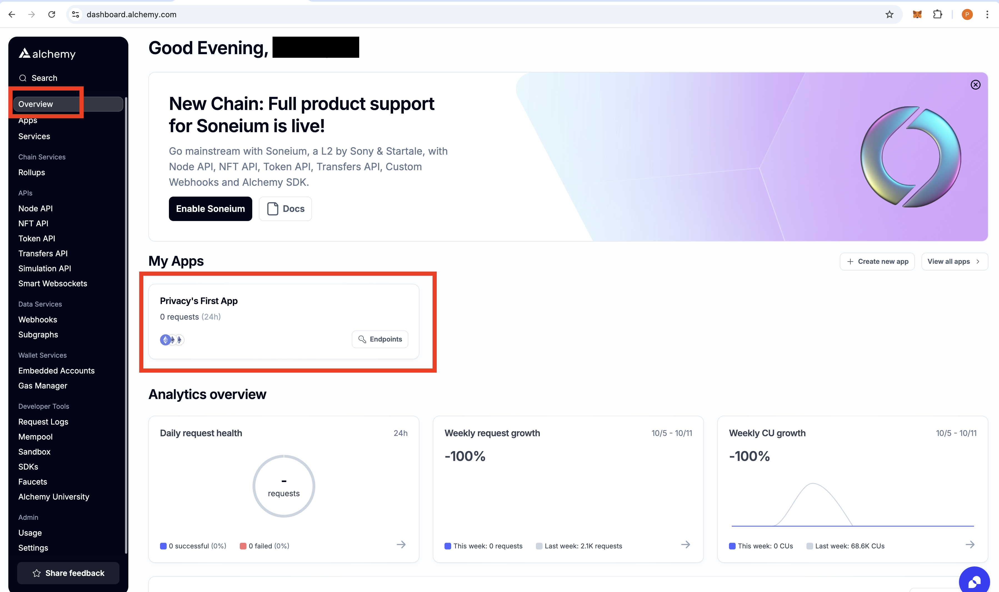
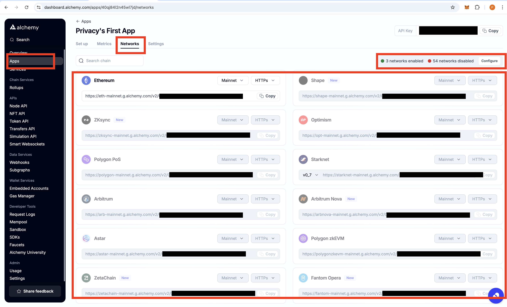
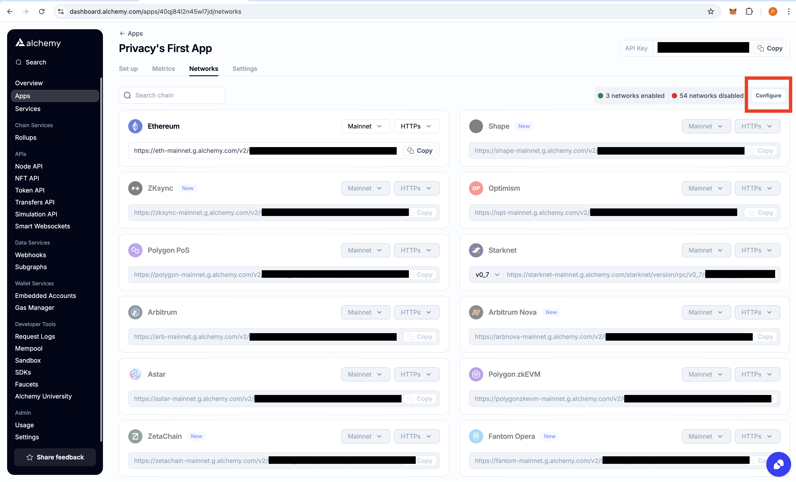
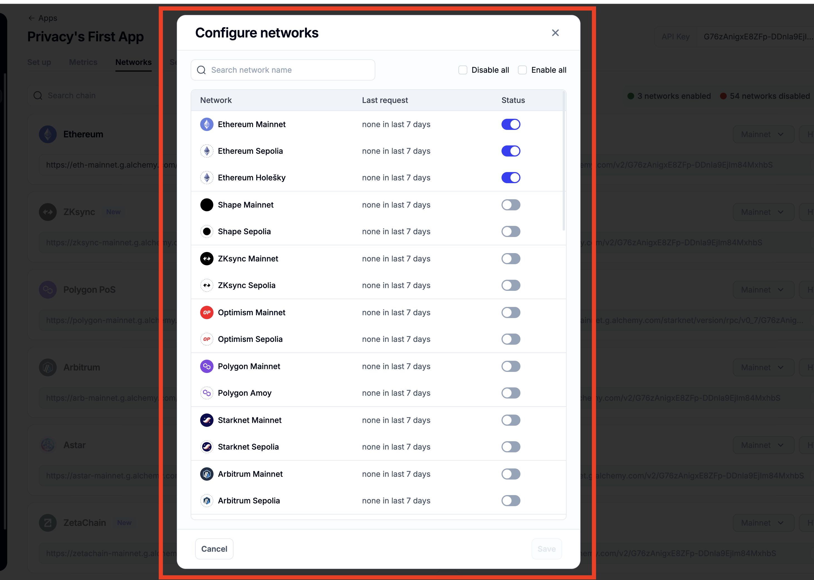
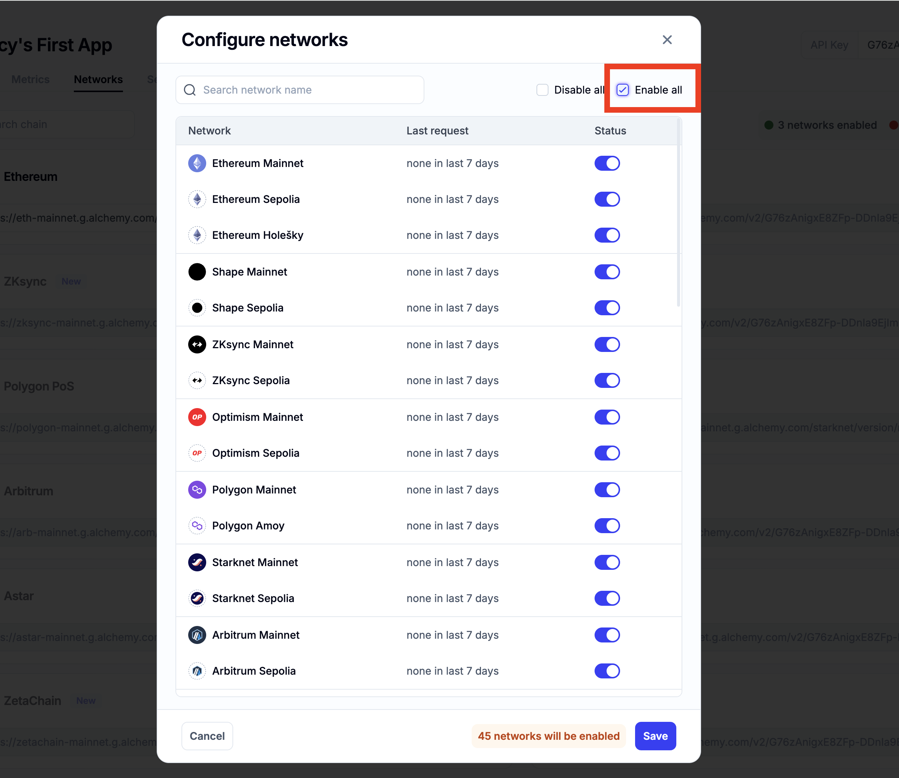
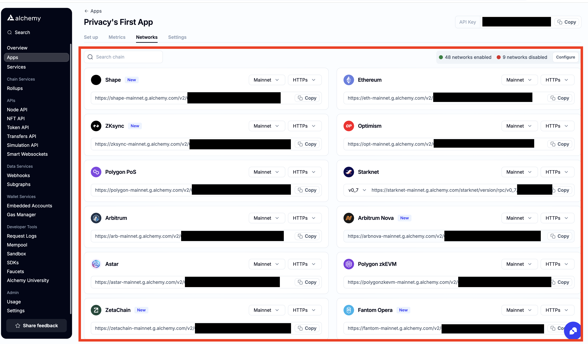
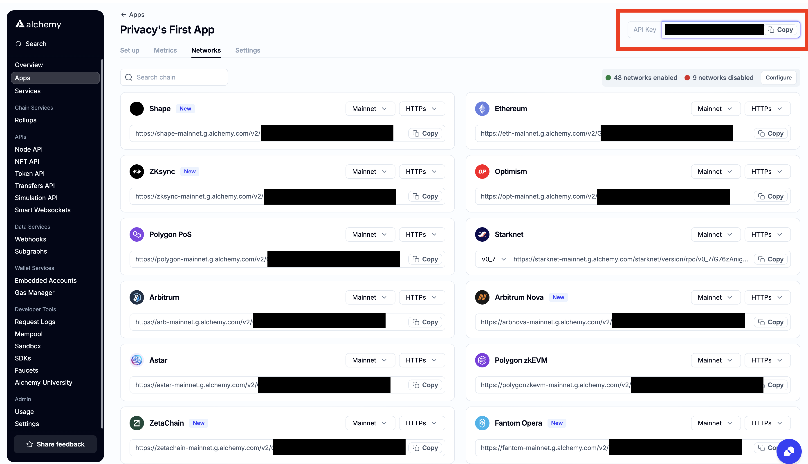

# How to get your Alchemy API key

1. Go to <a href="https://www.alchemy.com" target="_blank">Alchemy</a> and click on `Get your API key` button.

2. Sign up for an account or log in if you already have one.

3. If you are a new user, you will be asked to fill in your details. Select Personal and click on `Next`.

4. Select the plan. In this case, we will select the free plan. Click on `Next`.

5. You will be ask payment details. However, you can skip this step by clicking on `Skip bonus`.

6. You will be redirected to the dashboard. In the center of the page, you will see your API key. Copy it and paste it to the CLI when asked.

That's it! You have successfully obtained your Alchemy API key.

Note: If you're using Base network and encounter an error like invalid API Key or any API-related issue, it’s likely because your Alchemy app is not properly configured. By default, Alchemy only enables the network you selected when creating the app and disables all other networks. To fix this, you need to update your Alchemy app settings and configure the API key for the Base network. Here's how to do it.

1. In the sidebar, click on the `Overview` button to open the Overview tab. Under `My Apps`, select the app you created.

2. In the `Network` tab, check the status of the networks. If the networks are greyed out, they are currently disabled.

3. Click on the `Configure` button.

4. To enable only the Base network, scroll down, toggle the switch for Base(mainnet and testnet), and save your changes.

5. To enable all networks, check the `Enable All` option and save.

6. Go back to the Network tab, and you should see the selected network (or all networks) now enabled.

7. At the top of the page, you'll find your API key. Copy it and use it in the CLI when prompted.

