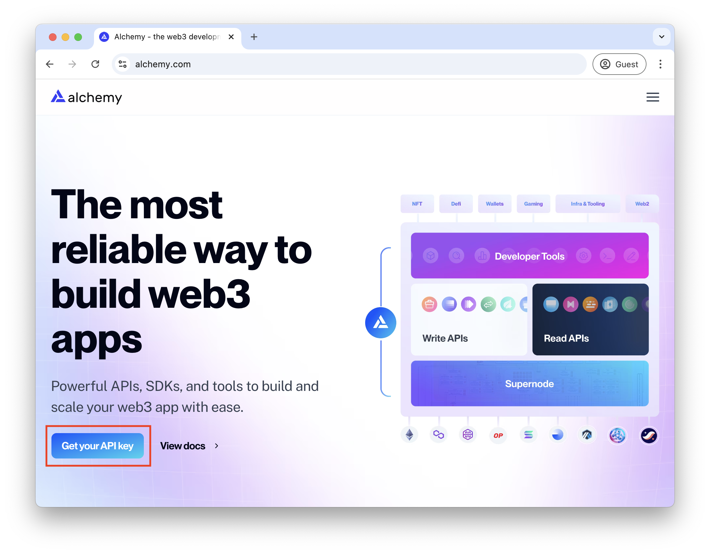
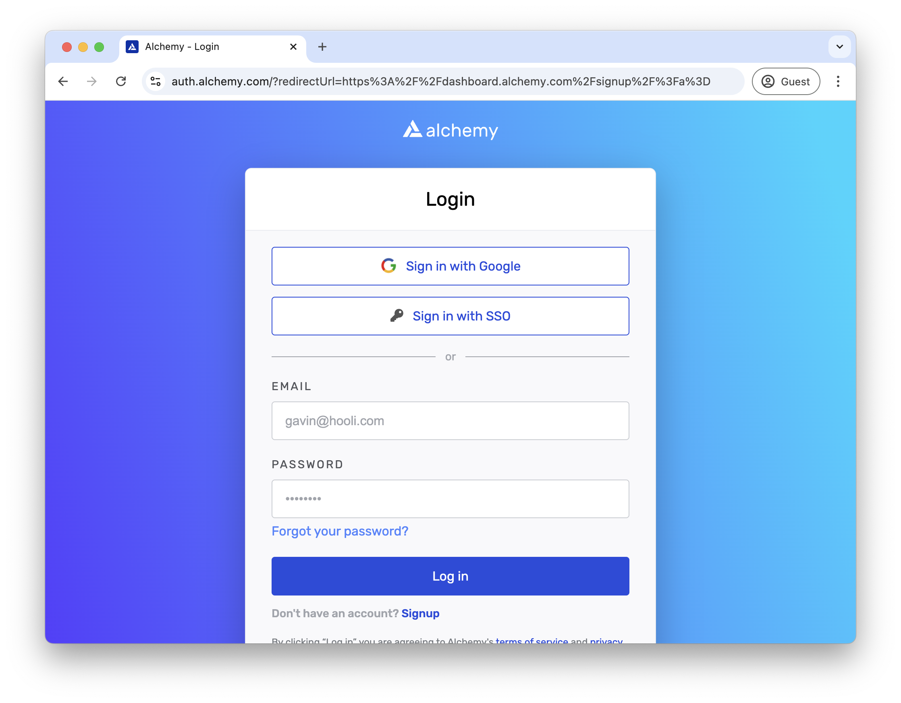
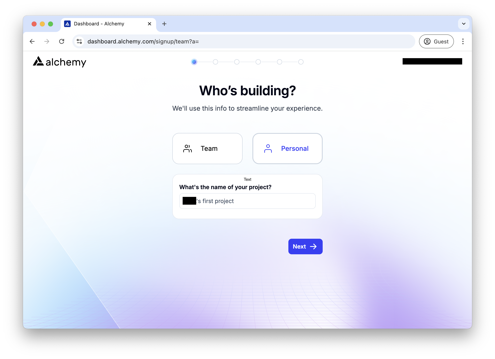
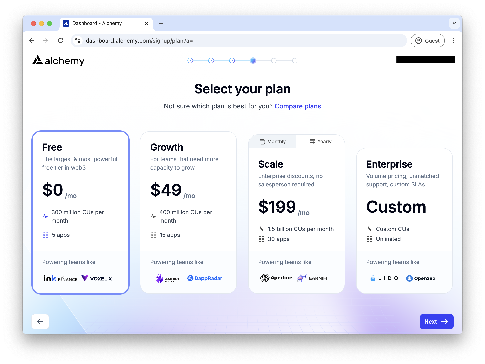
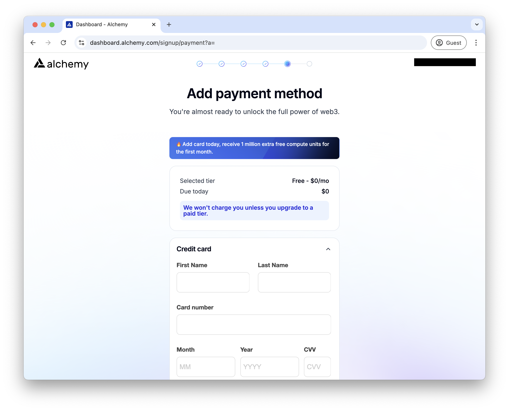

# How to get your Alchemy API key

1. Go to <a href="https://www.alchemy.com" target="_blank">Alchemy</a> and click on `Get your API key` button.

2. Sign up for an account or log in if you already have one.

3. If you are a new user, you will be asked to fill in your details. Select Personal and click on `Next`.

4. Select the plan. In this case, we will select the free plan. Click on `Next`.

5. You will be ask payment details. However, you can skip this step by clicking on `Skip bonus`.

6. You will be redirected to the dashboard. In the center of the page, you will see your API key. Copy it and paste it to the CLI when asked.

That's it! You have successfully obtained your Alchemy API key.
