## Quick Start Guide For Base Mainnet

This guide explains how to start mining on the Intmax network using the intmax2 mining CLI. While the instructions below describe the process for the Base Mainnet.

‚ùó Note: The tokens you receive through mining on Base Mainnet currently cannot be transferred to other addresses, but this feature will be enabled in the future.

🆘 Support: Please join this with an anonymous account
https://discord.gg/nByKNNhyvn

## Prerequisites

Before you begin, please ensure you have the following:

- **Ethereum (ETH)**: A minimum of 0.1 ETH on Base Mainnet plus additional ETH for gas fees.
- **Alchemy or Infura API key**: You need either an Alchemy or Infura API key. Please refer to [this guide for Alchemy](./alchemy_guide.md) or [this guide for Infura](./infura-guide.md) to obtain your API key.
- **Withdrawal Private Key**: The private key of the address you'll use to withdraw ETH and receive ITX tokens. Find instructions for Metamask [here](https://support.metamask.io/managing-my-wallet/secret-recovery-phrase-and-private-keys/how-to-export-an-accounts-private-key/).

## Download the Mining CLI

1. Navigate to the [Releases](https://github.com/InternetMaximalism/intmax2-mining-cli/releases) page of this repository.
2. Download the ZIP file appropriate for your operating system.
3. Extract the contents of the ZIP file.

## Quick Links

- [How To Set Up the Mining CLI](#setting-up-mining-cli)

  - [First-Time User Setup](#first-time-user-setup)

  - [Setup for Returning Users](#setup-for-returning-users)
- [How Mining Works](#how-mining-works)
- [How To Claim ITX Tokens](#claiming-itx-tokens)
- [How To Withdraw Your ETH](#withdraw-eth)
- [How To Export Deposit Private Keys](#exporting-deposit-private-keys)
- [How To Check for CLI Updates](#check-available-cli-updates)
- [How To Update CLI Version](#update-cli-version)
- [How To Modify Existing Config File](#modify-existing-config-file)

## Setting Up Mining CLI

1.  **Launch the CLI:** Double-click on the mining-cli shown in this image to launch.

   

     

> NOTICE: If you're using a Mac, you may see a message saying "Cannot be opened because the developer cannot be verified" as shown in the image. In that case, you need to change your Mac's security settings by referring to this link: https://support.apple.com/en/guide/mac-help/mh40616/mac

  

    

     

2. **Select Network**:
   When you double-click the CLI, you'll see a screen like this:

  

    

You can move the cursor with the arrow keys, select `base` and press `Enter`.
 

## First-Time User Setup

1. **Enter API API key**: Select `Alchemy` or `Infura` and enter your API key which you obtained. Your API key will not be displayed. Press `Enter` after pasting it.

 

2. **Configure settings for the mining process**: Set `max gas price`, `mining unit`, and `mining times`. You can use the default values by pressing `Enter` or pressing `y`. We recommend using the default values.

 

Here is the explanation of each setting:

- **Max Gas Price**: The maximum gas price allowed when executing transactions. Setting a higher value will cause undesirable funds loss.

- **Mining Unit**: The amount of ETH to send in one deposit. The default is 0.1 ETH.

- **Mining Times**: Specifies how many times to mine. The default is 10 times for Base.

You can also set your own values by pressing `n`, then entering the desired values.
 

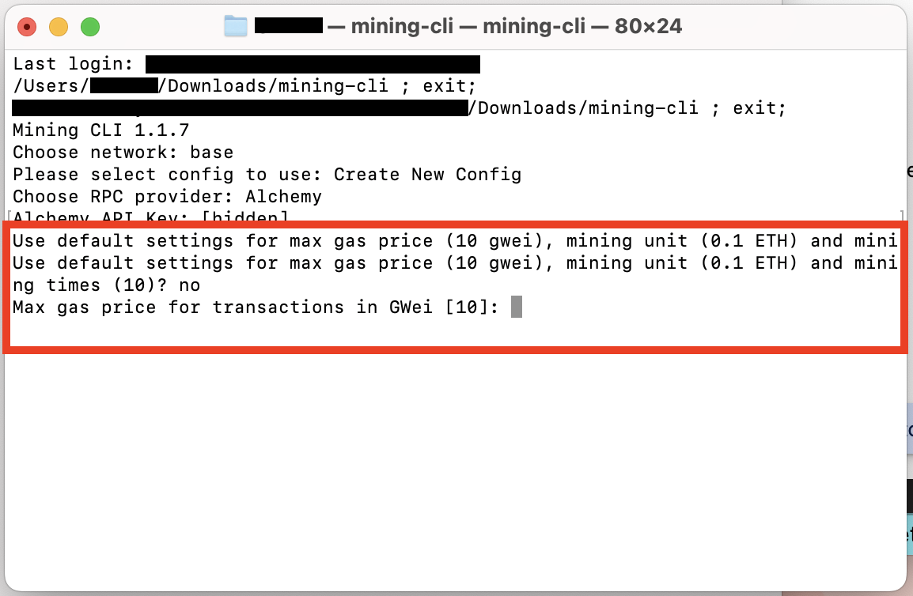
 

Enter your desired gas price. It’s recommended to keep the maximum gas price at the default value of 10 to avoid unnecessary loss of funds.

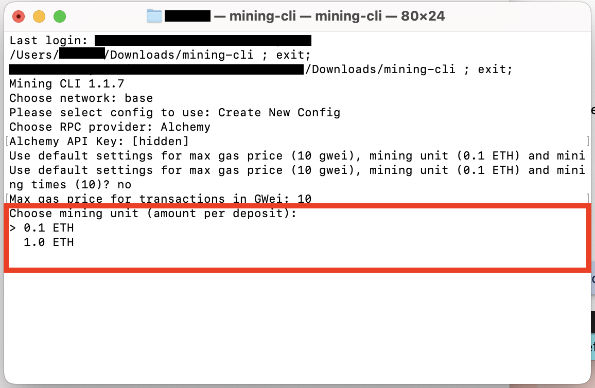
 

Select the mining unit per deposit: You can choose either 0.1 ETH or 1 ETH.

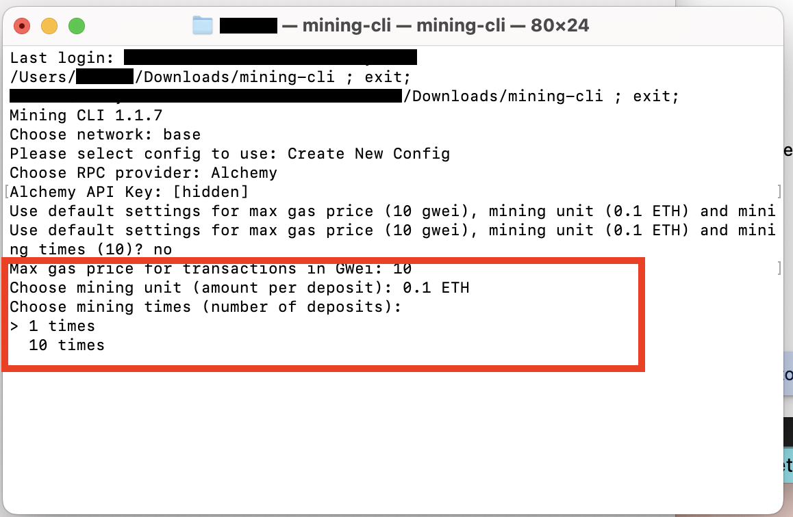
 

Choose the number of times to mine: It’s highly recommended to mine 10 times instead of just once.

> **Recommendation**: To maximize your earnings and enhance your privacy:
>
> - Split your funds into smaller deposits.
>
> - Mining in smaller increments (e.g., 10 deposits) can earn up to 300 times the reward of a single large
>   deposit. For example: You can deposit and mine 0.1 ETH or 1 ETH in 10 smaller increments for better rewards and privacy.
>    

3. **Enter Withdrawal Private Key**: Enter the private key of the address you'll use to withdraw ETH and receive ITX tokens. Your withdrawal private key will not be displayed. Press `Enter` after pasting it.

 

After entering the withdrawal private key, the address will be displayed. Confirm that the address is correct.

‚ùó Note: It is recommended to use an empty wallet as your withdrawal address. Make sure not to deposit directly into this address from the deposit address generated for you during mining._

4. **Choose whether to encrypt the private key**: Choose whether to encrypt the private key. Because the withdrawal private key will be stored in local storage, we highly recommend encrypting it. Press `y` or `Enter` to encrypt the private key, or `n` to store it in plain text.

 

5. **Enter a password for the private key**: If you choose to encrypt the private key, you'll be asked to enter a password. Please enter a password of at least 12 characters.

 

You would be shown a prompt saying only claiming and withdrawal is allowed for now. Press enter to be taken to the next screen.

 

## Setup for Returning Users

1. **Continue**:
   After selecting `base`, you'll see a screen like this:

  

    

Here is the explanation of each setting:

- **Continue**: Continue mining with the existing settings in the config file

- **Overwrite**: This allows you to clear existing settings and set new ones. It is recommended to create a new config instead until after claiming tokens.

- **Modify**: Modify some of the existing settings and change them, e.g, change withdrawal private key, etc. Note that when using this method, mining times and mining unit cannot be changed.
    

2. **Enter password for the private key**:
   If you choose to encrypt your password during setup, you'll be prompted to enter it. This step is optional and won't appear if you didn't set a password.

  

    

     

**Select Mode**: Choose from the following modes using the arrows key: `Mining`, `Claim`, `Exit`, `Export` or `Check Updates`.

Here is the explanation of each mode:

- **Start Mining**: performs mining by repeatedly executing deposits and withdrawals

- **Claim**: claims available ITX tokens

- **Exit**: withdraws all balances in intmax2 and cancels pending deposits

- **Export**: exports the private key of the deposit addresses

- **Check Updates**: check and update the latest CLI version

## How Mining Works

1. **Deposit ETH to your deposit address**:

The mining process will begin.

 

The CLI will generate a deposit address and display it. For the first time, the deposit account will not have any balance. CLI will display the required amount of ETH to deposit (equals to `(mining unit)*(mining times) + (gas fees for deposits)`). Please send the required amount of ETH to the deposit address.

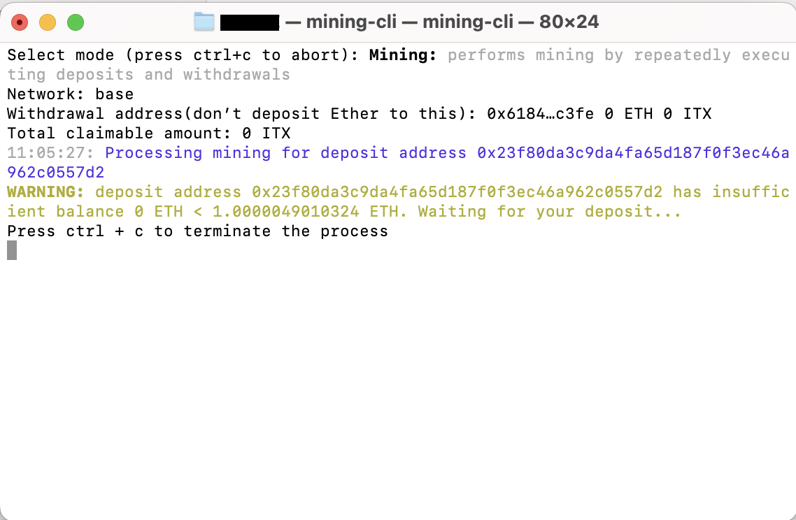

 

2. **Mining Process**:

CLI automatically deposits and withdraws ETH.

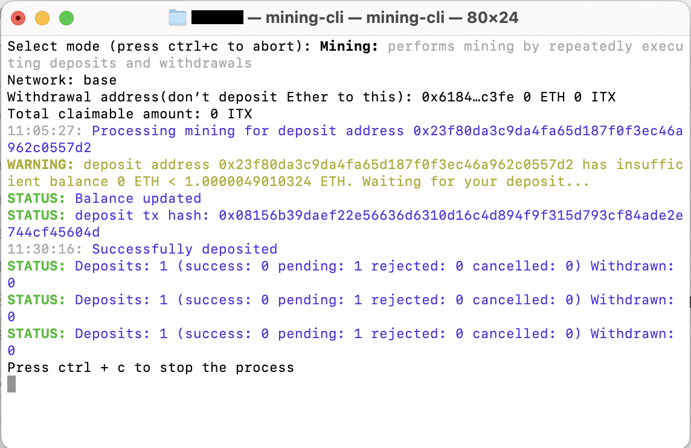

The mining process will pause if

- the balance of the deposit address is insufficient: please send ETH to the deposit address

- the network's gas price is higher than the max gas price setting: wait until the network's gas price drops or change the `max gas price` value, refer to this [guide](#modify-existing-config-file).

- the number of `mining times` is reached: CLI will generate a new deposit address. Please send ETH to the new deposit address.
    

3. **After Mining**:

After mining successfully end, you can safely close the CLI window or press `Enter` to go back to the commands page.

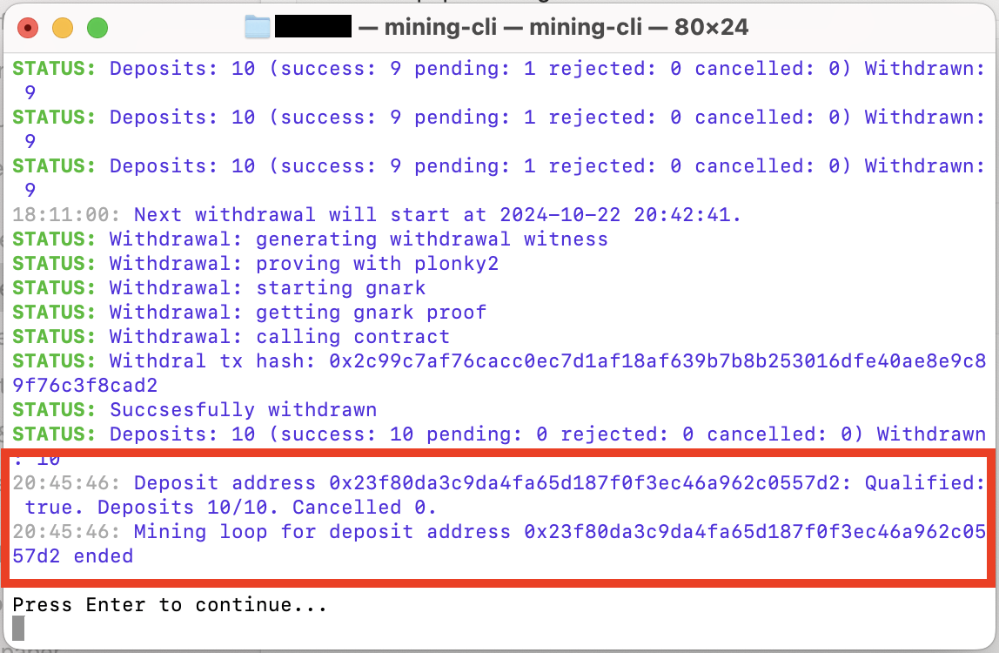

You can restart the mining process by selecting `Create New Config` and selecting `Mining` mode when you restart the CLI.
 

4. **Stop and Resume process**:

There are the wait intervals for depositing and withdrawing during mining process. Minimum interval is 1 hour, and maximum interval is 6 hours. Average interval is 3.5 hours, so it takes 3.5* 2 *10 = 70 hours in average to finish 10 times mining. Note that Interval is chosen randomly each time.

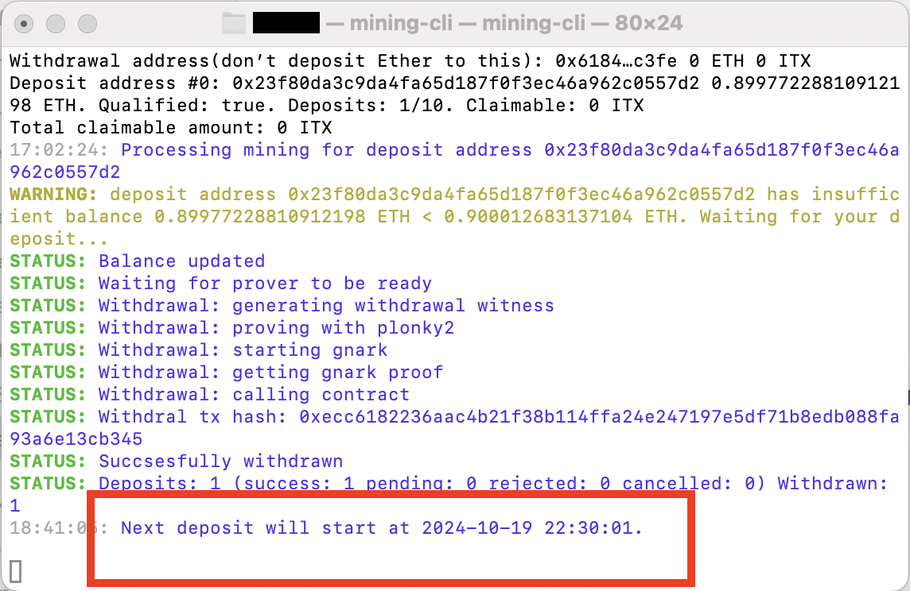

You can safely close the CLI window during the wait interval, when you restart the CLI, you can resume the mining process by selecting `Mining` mode. Mining cli would resume process automatically after the elapses, provided your device is connected to internet connection.

‚ùó Note: If you stop the mining process when there is a balance in the intmax2, you can withdraw the balance by running in `Exit` mode, or you can continue the mining process by running in `Mining` mode.

## Claiming ITX Tokens

The deposits eligible for ITX tokens are confirmed at UTC 0:00 on the Monday two weeks after mining. After that, you claim ITX tokens.

1. **Select Mode**:
To claim ITX token, select `Claim`. You can check whether an deposit address is eligible for rewards in the "Qualified" column after selecting the mode.
  

    

     

2. **Claim ITX Token To Withdrawal Address**:
   If `Claim` was selected and your address qualifies for ITX tokens, the CLI automatically transfers your available ITX tokens to your withdrawal wallet immediately or when the token availablity time reaches. To see the tokens in your wallet, ensure to add the ITX mainnet token contract address to your wallet using this [guide](./add_token_to_wallet.md).

  

    

Check wallet to see tokens.

After claiming process is done, you can proceed to retreiving available ETH in the Intmax2 Network back to your withdrawal address. Proceed by pressing any key as instructed by CLI.

## Withdraw ETH

> Important: Avoid making direct or indirect transfers between deposit and withdrawal addresses. Depositing in a withdrawal address will disqualify it from receiving rewards during mining. Please refer to the [README document](../README.md) for more information.

1. **Withdraw ETH**:
   Select `Exit` to retrieve assets to withdrawal address.

  

    

     

2. **Withdraw ETH To Withdrawal Address**:
   Any pending deposit would be cancelled and all ETH balance will be withdrawn to your withdrawal address.

  

    

     

‚ùó Note: If there are still ETH in your deposit address after this process, you can manually transfer ETH from deposit wallet to another wallet using the command below. Proceed by pressing any key as instructed by CLI.
 

## Exporting Deposit Private Keys

1. **Export**:
   Select `Export`

  

    

     

2. **Export Deposit Private Key**:
   Copy private key and import account into metamask using this [guide](https://support.metamask.io/managing-my-wallet/accounts-and-addresses/how-to-import-an-account/).

  

    

     

3. **Transfer in CLI**:
   To transfer ETH balance inside the CLI instead, type yes and select `#0` or your account of choice if you have several deposit accounts.

  

    

     

4. **Transfer ETH Balance**:
Paste the address to transfer ETH balance to.

  

   

5. **Transfer in CLI**:
Approve transfer by typing `Yes`.
  

    

Repeat approval until ETH balance is insufficient. To end the process, press `Enter` key.

  

    

After withdrawal process is done, proceed by pressing any key as instructed by CLI.

## Update CLI Version

1. **Select Mode**:
Select `Check Update` to check if you are using the latest version.
  

    

     

2. **Confirm CLI Version**:
   Your current version should be same as the latest release to mine. Navigate to the [Releases](https://github.com/InternetMaximalism/intmax2-mining-cli/releases) page of this repository to see the latest available version.

  

    

To continue with other modes, press `Enter` key on your keyboard.
 

## Modify Existing Config File

> _**Note**: The modify option will enable you to modify the existing config file settings and change them, e.g, change withdrawal private key. Note that when using this method, mining times and mining unit cannot be changed._

1. **Modify Option**:
   After selecting `base`, you'll see a screen like this:

  

    

     

2. **Enter password for the private key**:
   If you choose to encrypt your password during setup, you'll be prompted to enter it. This step is optional and won't appear if you didn't set a password.

  

    

Here is the explanation of each of the settings you can modify:

- **API Key**: This allows you to change Alchemy/Infura API key

- **Gas Price**: This allows you to change the maximum gas price amount used in one transaction. The default and recommended gas price is 10.

- **Withdrawal Private Key**: This allows you to change the withdraw address you'll use to withdraw ETH and receive ITX tokens.
    

3. **Modify API Key**: To change Api Key, type `y`. To ignore and move to the next setting option, type `N`.

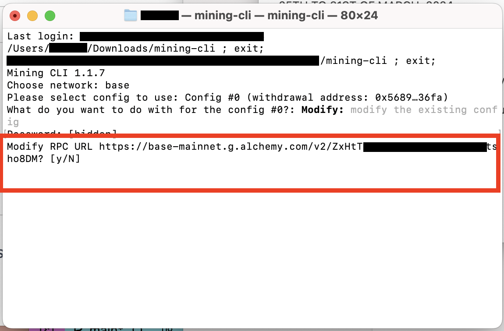

 

Select `Alchemy` or `Infura` and enter your new API key which you obtained from [the Alchemy](./alchemy_guide.md) or [the Infura](./infura-guide.md) guide.

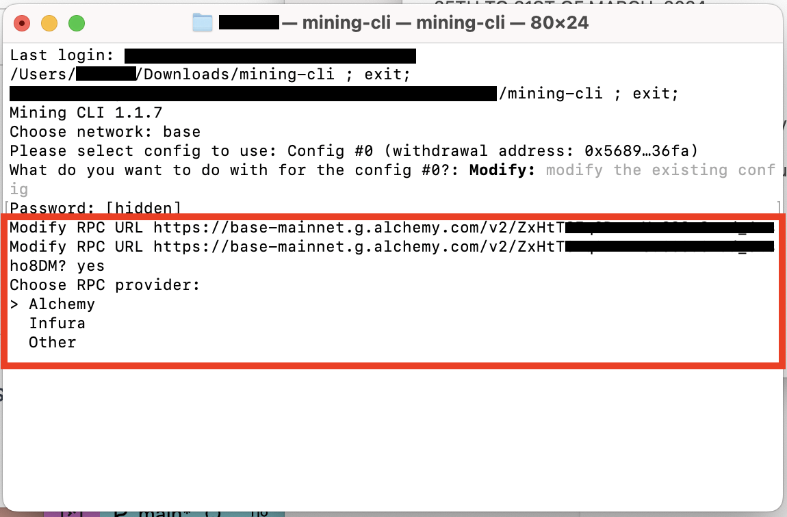

 

Note that your API key will not be displayed. 

Press `Enter` after pasting it.

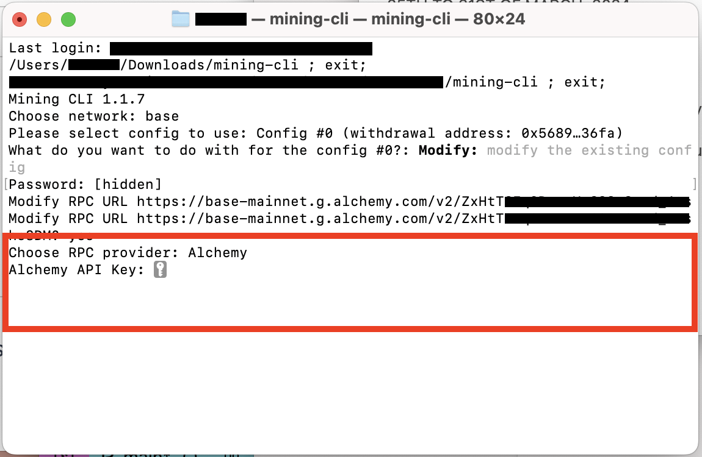

 

4. **Modify Gas price**: To modify gas price, type `y`. To ignore and move to the next setting option, type `N`.

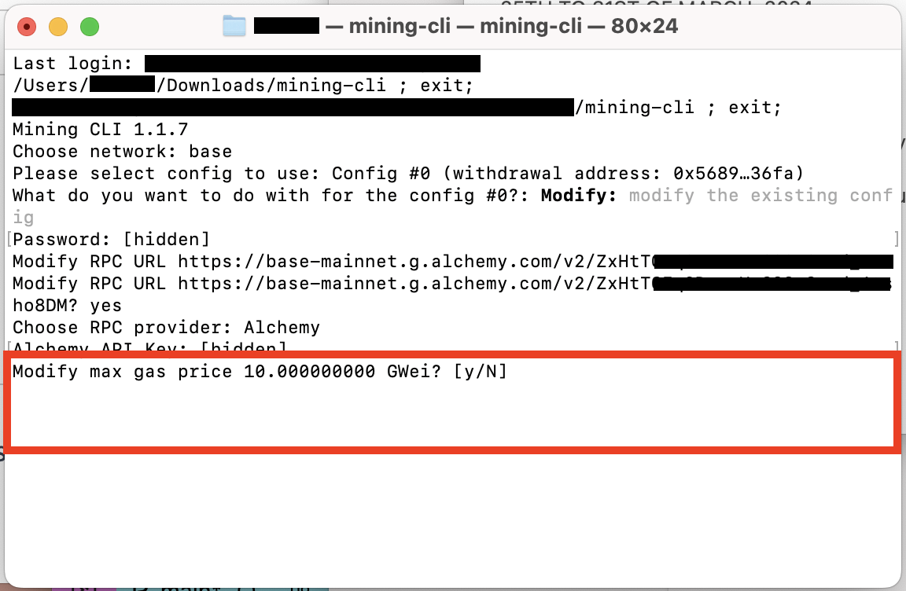

 

It is recommended to leave the maximum gas price at default value which is 10 allowed. Setting a higher value will cause undesirable funds loss.

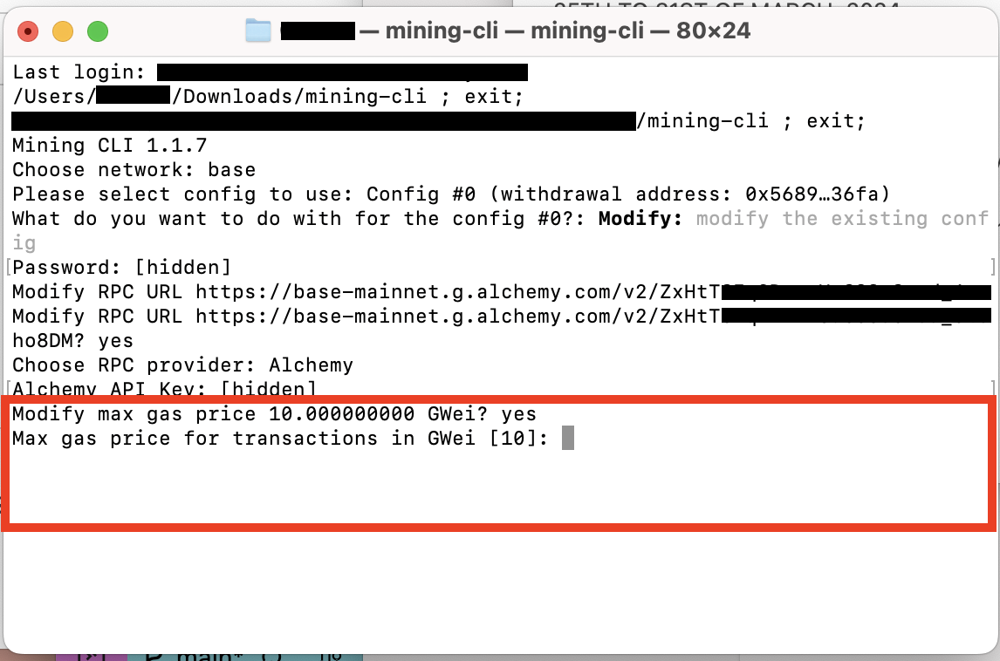

 

5. **Modify Withdrawal Private Key**: To change the withdrawal wallet, type `y`. To ignore and move to the next setting option, type `N`.

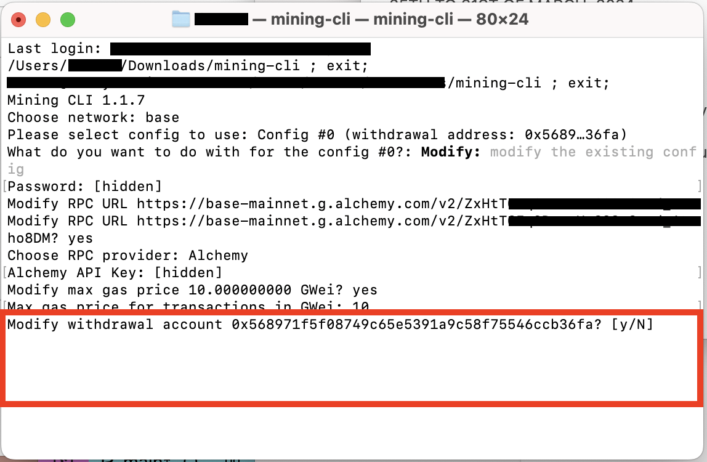

 

Enter the private key of the new address. Note that your withdrawal private key will not be displayed. Press `Enter` after pasting it.

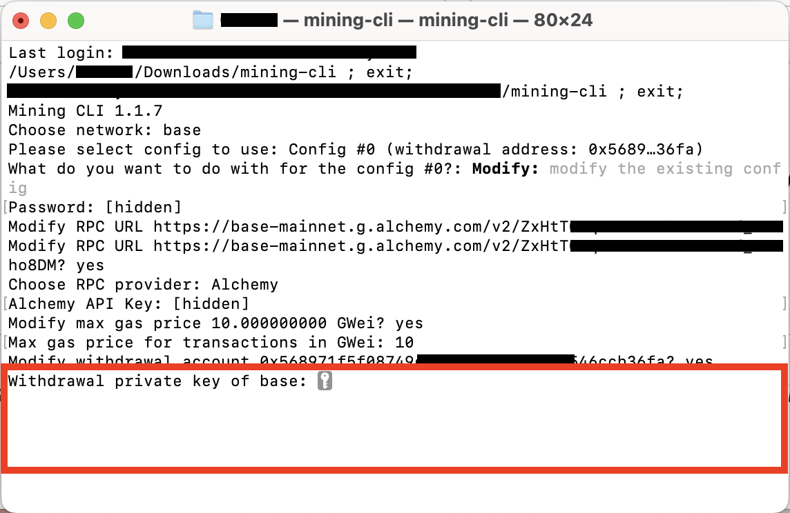

‚ùó Note: It is recommended to use an empty wallet as your withdrawal address. Make sure not to deposit directly into this address from the deposit address generated for you during mining. Also, ensure you use a wallet address that has not been linked to another config file.
 

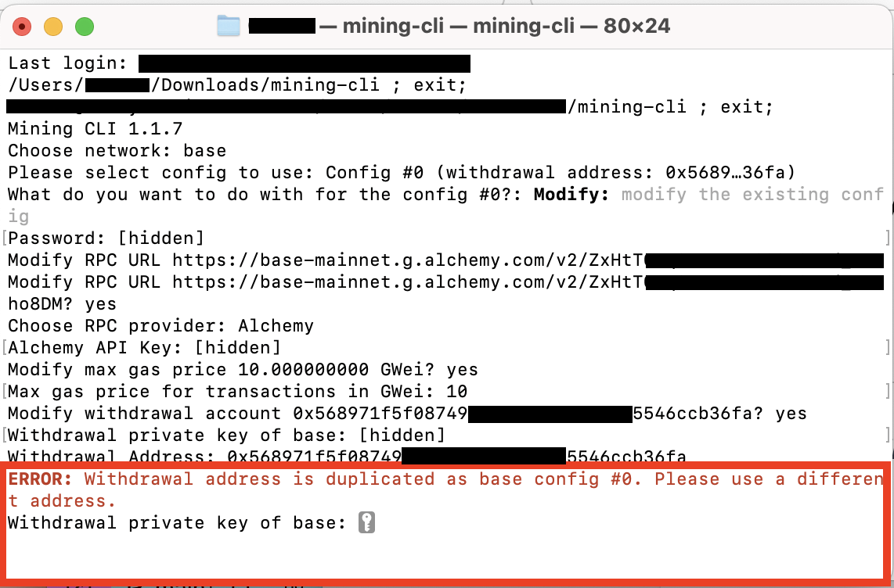

After entering the right withdrawal private key, the address will be displayed.
 

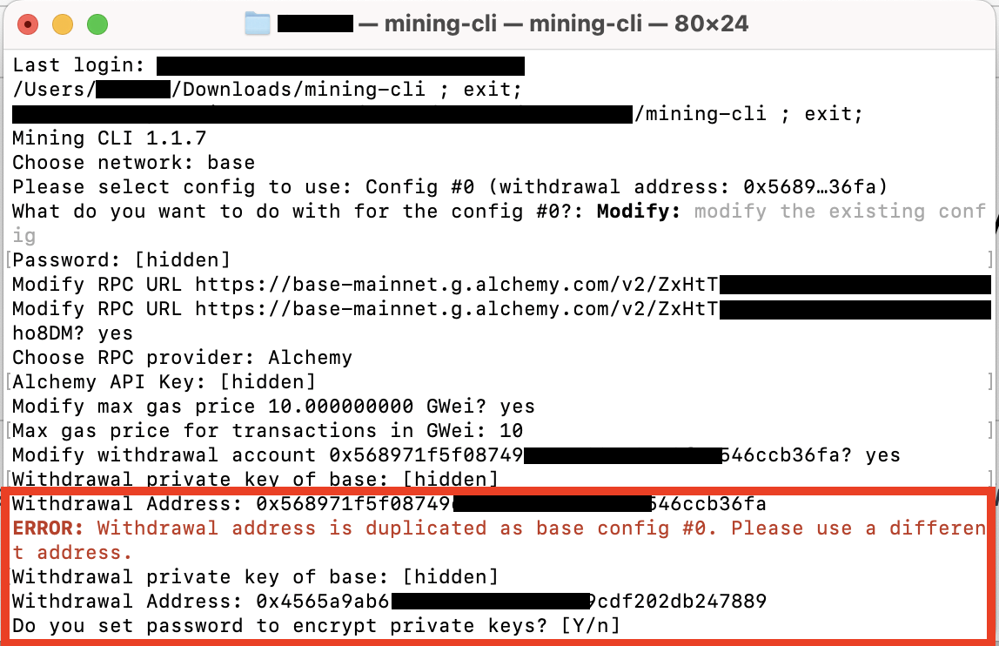

You can choose whether to encrypt the private key by setting a password. Because the withdrawal private key will be stored in local storage, we highly recommend encrypting it. Press `y` or `Enter` to encrypt the private key, or `n` to store it in plain text.
