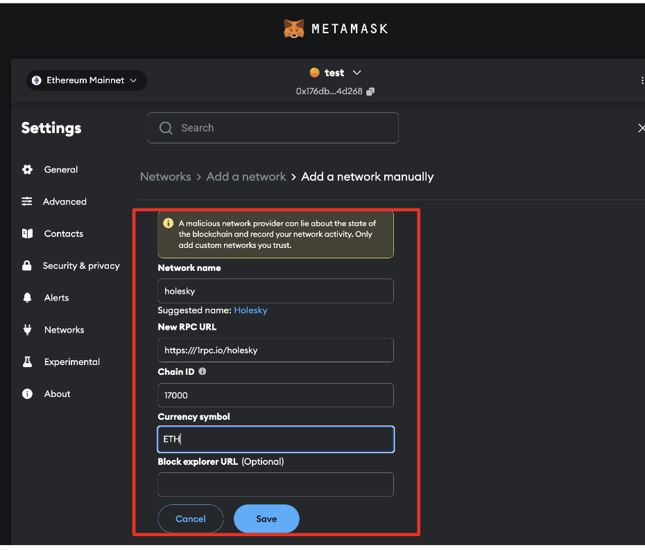
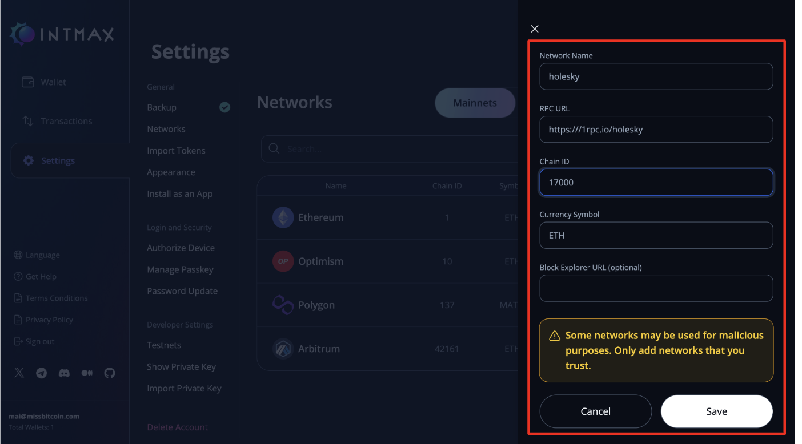
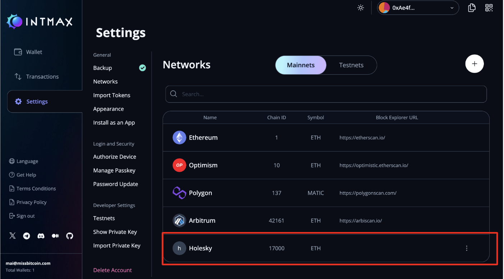

# How to use Holesky testnet

## Add Holesky testnet to your MetaMask

1. Open Metamask and click on the network icon in the top left corner.

  

2. Select "Add Network" from the dropdown.

  

3. Click on "Add a network manually."

  

4. Add the following information:
   - Network Name: `Holesky`
   - Network RPC URL: `https://1rpc.io/holesky`
   - Chain ID: `17000`
   - Currency Symbol: `ETH`

    

5. Click on "Save" to add the Holesky testnet to your MetaMask.

    

## Add Holesky testnet to your Intmax wallet

1. Click on "Settings."

  

2. Click on "Networks" and press the plus button in the top right corner.

  

3. Add the following information:
   - Network Name: `Holesky`
   - Network RPC URL: `https://1rpc.io/holesky`
   - Chain ID: `17000`
   - Currency Symbol: `ETH`

    

4. Completed.

    

## Get testnet ETH

You can access the link below to receive the Holesky **Faucet**. You can receive 1 ETH (on the Holesky network) once a day with a single Google account.

[https://cloud.google.com/application/web3/faucet/ethereum/holesky](https://cloud.google.com/application/web3/faucet/ethereum/holesky)

What is a faucet?

A faucet is an application that dispenses free tokens on a testnet (a blockchain network used for development and testing). These tokens allow you to experiment with the testnet, such as deploying smart contracts or debugging transactions. The Google Cloud faucet provides web3 developers with free tokens for deploying, testing, and optimizing smart contracts on popular testnets like Holesky and Sepolia.

It's important to remember that testnet tokens have no real-world value and cannot be sold or used on the main blockchain network (like Ethereum mainnet).

