## Quick Start Guide For Base Mainnet

This guide explains how to start mining on the Base network using the intmax2 mining CLI. The instructions below describe the process for the Base Mainnet.

❗ Note: The tokens you receive through mining on the mainnet currently cannot be transferred to other addresses, but this feature will be enabled in the future.

🆘 Support: please join this with an anonymous account
https://discord.gg/nByKNNhyvn

## Prerequisites

Before you begin, please ensure you have the following:

- **Ethereum (ETH)**: A minimum of 0.1 ETH on Base mainnet plus additional ETH for gas fees.
- **Alchemy API key**: Please refer to the [How to get your Alchemy API key](./alchemy.md) guide to obtain your API key.
- **Withdrawal Private Key**: The private key of the address you'll use to withdraw ETH and receive ITX tokens.(Instruction for Metamask [here](https://support.metamask.io/managing-my-wallet/secret-recovery-phrase-and-private-keys/how-to-export-an-accounts-private-key/))

## Download the CLI

1. Navigate to the [Releases](https://github.com/InternetMaximalism/intmax2-mining-cli/releases) page of this repository.
2. Download the ZIP file appropriate for your operating system.
3. Extract the contents of the ZIP file.

## Step-by-Step Instructions

### Setting Up Mining CLI

1.  **Lauching the CLI** Double-click on the mining-cli shown in this image to launch.

   

     

> NOTICE: If you're using a Mac, you may see a message saying "Cannot be opened because the developer cannot be verified" as shown in the image. In that case, you need to change your Mac's security settings by referring to this link: https://support.apple.com/en/guide/mac-help/mh40616/mac

  

    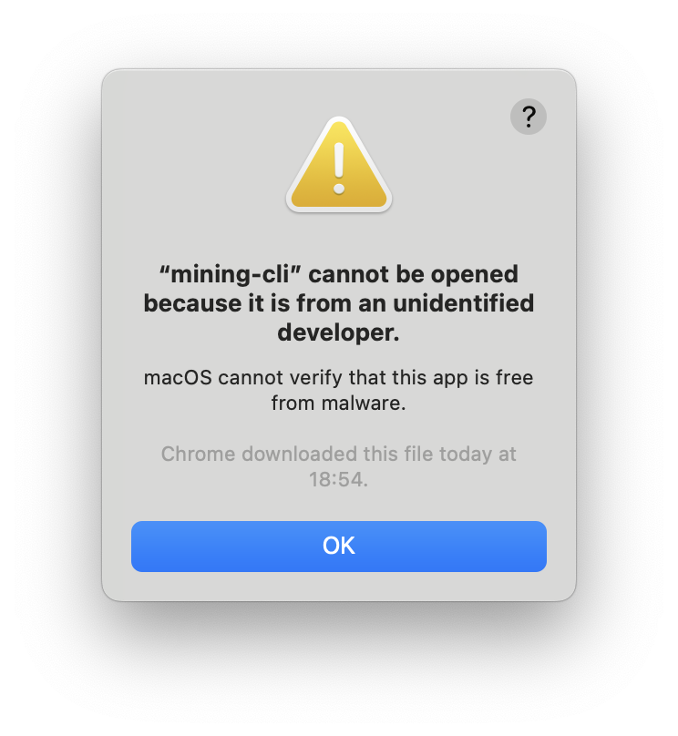

2. **Select Network**:
When you double-click the CLI, you'll see a screen like this:

  

    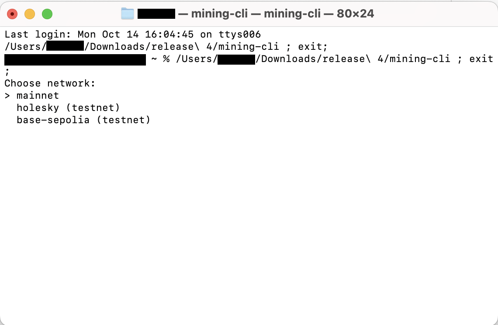

You can move the cursor with the arrow keys, select `mainnet` and press `Enter`.

### First-Time User Setup

1. **Enter Alchemy API key**: Select `Alchemy` and enter your API key which you obtained from [How to get your Alchemy API key](./alchemy.md) guide. Your API key will not be displayed. Press `Enter` after pasting it.

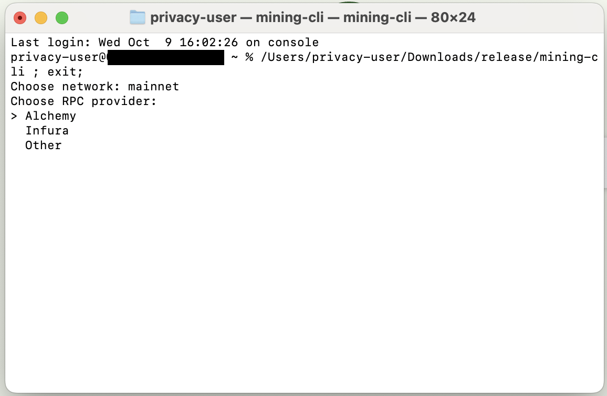

2. **Configure settings for the mining process**: Set `max gas price`, `mining unit`, and `mining times`. You can use the default values by pressing `Enter` or pressing `y`. You can also set your own values by pressing `n`, then entering the desired values. We recommend using the default values.

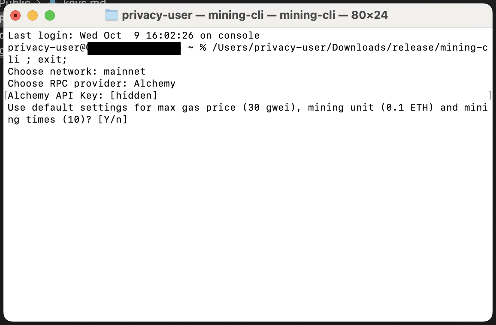

Here is the explanation of each setting:

- **Max Gas Price**: The maximum gas price allowed when executing transactions. Setting a higher value will cause undesirable funds loss.
- **Mining Unit**: The amount of ETH to send in one deposit. The default is 0.1 ETH.
- **Mining Times**: Specifies how many times to mine. The default is 10 times for mainnet.

3. **Enter Withdrawal Private Key**: Enter the private key of the address you'll use to withdraw ETH and receive ITX tokens. Your withdrawal private key will not be displayed. Press `Enter` after pasting it.

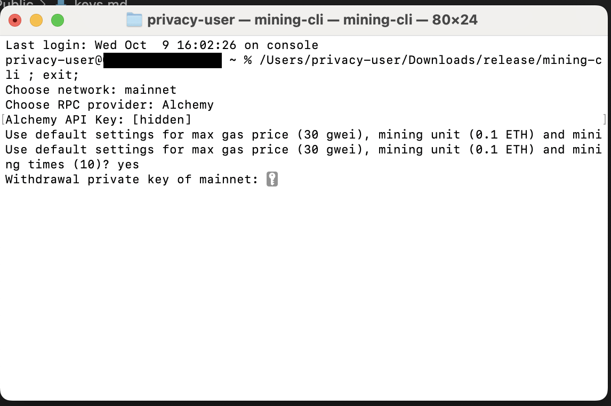

After entering the withdrawal private key, the address will be displayed. Confirm that the address is correct.

_Note: It is recommended to use an empty wallet as your withdrawal address. Make sure not to deposit directly into this address from the deposit address generated for you during mining._

4. **Choose whether to encrypt the private key**: Choose whether to encrypt the private key. Because the withdrawal private key will be stored in local storage, we highly recommend encrypting it. Press `y` or `Enter` to encrypt the private key, or `n` to store it in plain text.

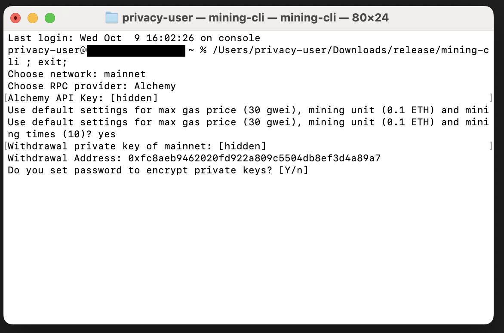

5. **Enter a password for the private key**: If you choose to encrypt the private key, you'll be asked to enter a password. Please enter a password of at least 12 characters.

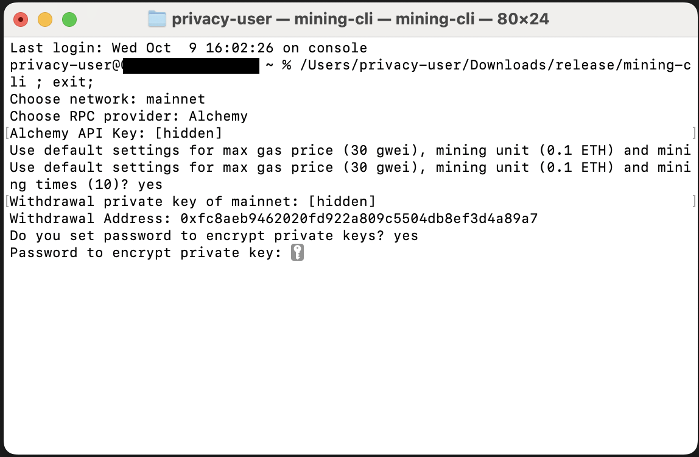

You would be shown a prompt saying only claiming and withdrawal is allowed for now. Press enter to be taken to the next screen.

### Setup for Returning Users

1. **Continue**:
After selecting `mainnet`, you'll see a screen like this:

  

    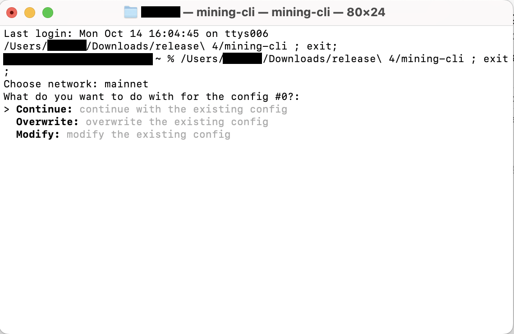

Mining has transitioned from Ethereum Mainnet to Base Network hence you won't be able to create a new config for mining but you would be able to continue with, overwrite or modify the existing mining config file.

Here is the explanation of each setting:

- **Continue**: Continue mining with the existing settings in the config file
- **Overwrite**: This allows you to clear existing settings and set new ones.
- **Modify**: Modify some of the existing settings and change them, e.g, change withdrawal private key. Note that when using this method, mining times and mining unit cannot be changed.

2. **Enter password for the private key**:
If you choose to encrypt your password during setup, you'll be prompted to enter it. This step is optional and won't appear if you didn't set a password.

  

    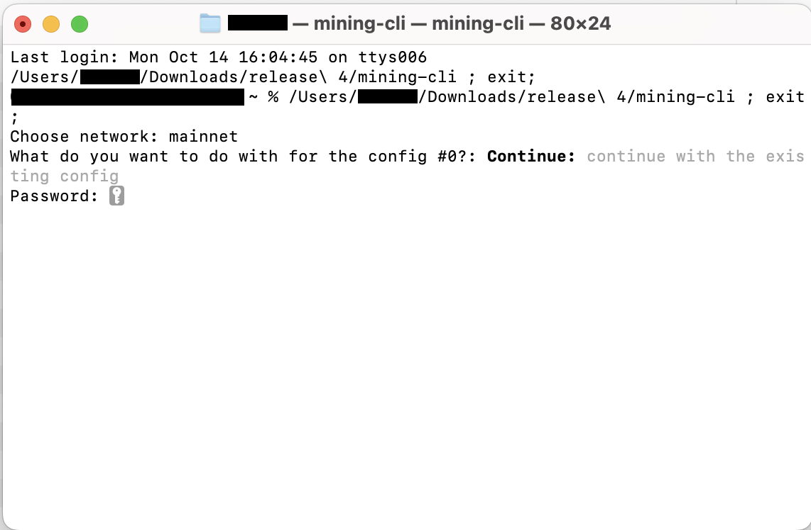

#### Select Mode

8. **Select Mode**: Choose from the following modes using the arrows key: `Mining`, `Claim`, `Exit` or `Export`. For this time, select `Mining`.

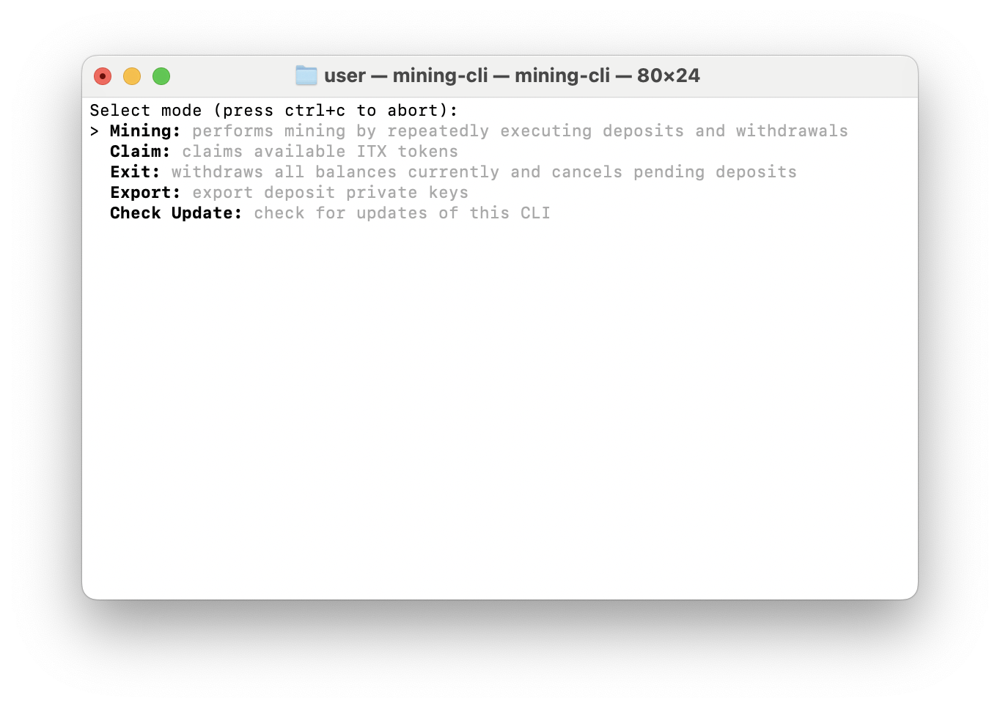

Here is the explanation of each mode:

- **Start Mining**: performs mining by repeatedly executing deposits and withdrawals
- **Claim**: claims available ITX tokens
- **Exit**: withdraws all balances in intmax2 and cancels pending deposits
- **Export**: exports the private key of the deposit addresses.

For this time, please select Mining.

### How Mining Works

1. **Deposit ETH to your deposit address**:

The mining process will begin.

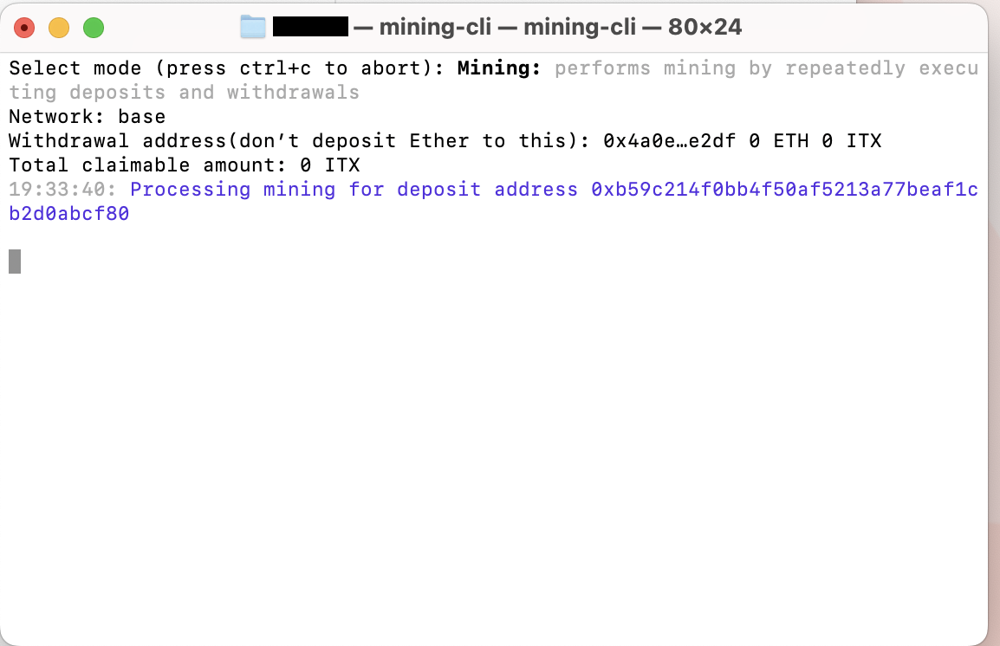

The CLI will generate a deposit address and display it. In the first time, the deposit account does not have any balance. CLI will display the required amount of ETH to deposit (equals to `(mining unit)*(mining times) + (gas fees for deposits)`). Please send the required amount of ETH to the deposit address.

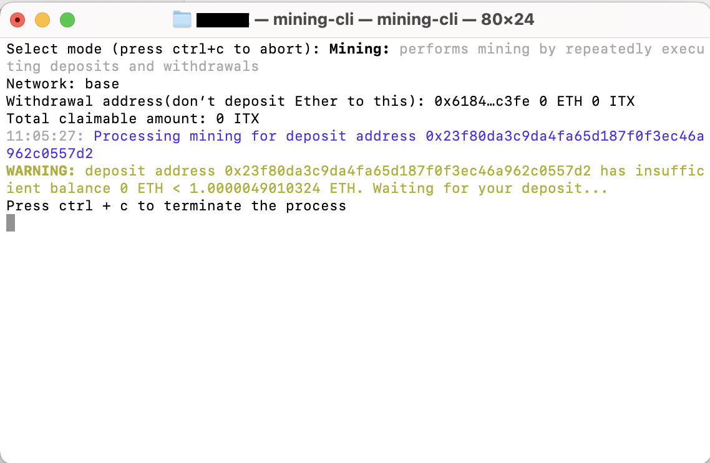

10. **Mining Process**:

CLI automatically deposits and withdraws ETH.

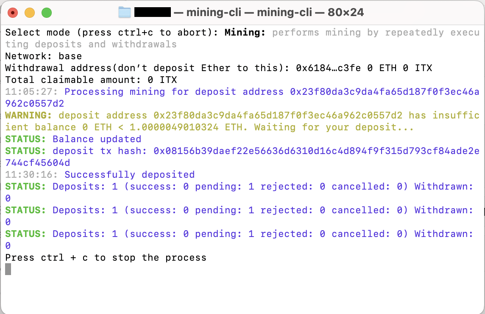

The mining process will pause if

- the balance of the deposit address is insufficient: please send ETH to the deposit address
- the network's gas price is higher than the max gas price setting: wait until the network's gas price drops or change the `max gas price` value.
- the number of `mining times` is reached: CLI will generate a new deposit address. Please send ETH to the new deposit address.

11. **After Mining**:

After mining successfully end, you can safely close the CLI window or press `Enter` to go back to the commands page.

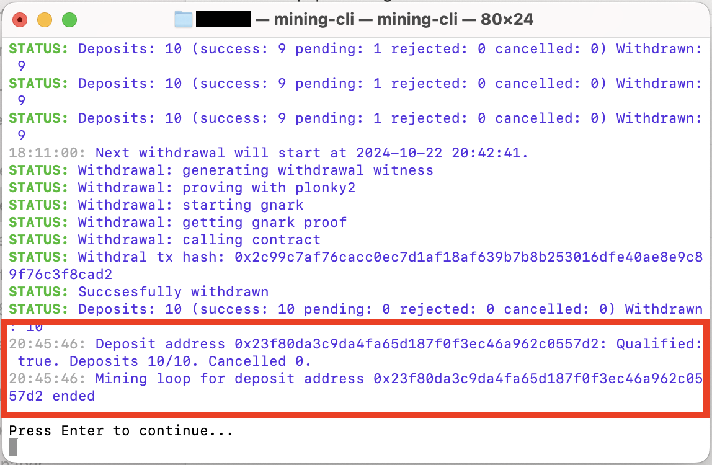

You can restart the mining process by selecting `Create New Config` and selecting `Mining` mode when you restart the CLI.

11. **Stop and Resume process**:

There are  the wait intervals for depositing and withdrawing during mining process. Minimum interval is 1 hour, and maximum interval is 6 hours. Average interval is 3.5 hours, so it takes 3.5* 2 *10 = 70 hours in average to finish 10 times mining. Note that Interval is chosen randomly each time.

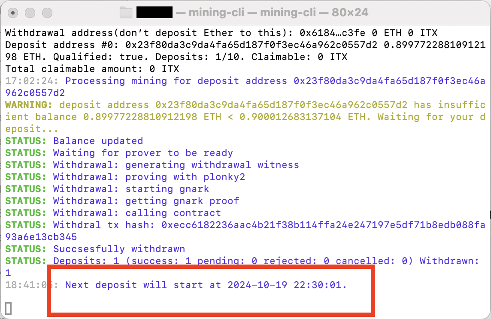

You can safely close the CLI window during the wait interval, when you restart the CLI, you can resume the mining process by selecting `Mining` mode. Mining cli would resume process automatically after the elapses, provided your device is connected to internet connection.
NOTE: If you stop the mining process when there is a balance in the intmax2, you can withdraw the balance by running in `Exit` mode, or you can continue the mining process by running in `Mining` mode.

### Claiming ITX Tokens

The deposits eligible for ITX tokens are confirmed at UTC 0:00 on the Monday two weeks after mining. After that, you claim ITX tokens.

1. **Select Mode**:
To claim ITX token, select `Claim`. You can check whether an deposit address is eligible for rewards in the "Qualified" column after selecting the mode.
  

    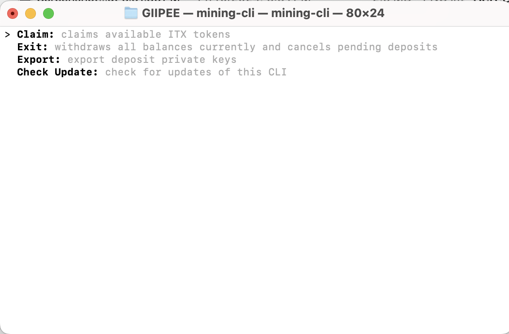

2. **Claim ITX Token To Withdrawal Address**:
If `Claim` was selected and your address qualifies for ITX tokens, the CLI automatically transfers your available ITX tokens to your withdrawal wallet immediately or when the token availablity time reaches. To see the tokens in your wallet, ensure to add the ITX mainnet token contract address to your wallet using the Network [guide](./holesky.md).

  

    

Check wallet to see tokens.

After claiming process is done, you can proceed to retreiving available ETH in the Intmax2 Network back to your withdrawal address. Proceed by pressing any key as instructed by CLI.

### Withdraw ETH

#### Important: Avoid making direct or indirect transfers between deposit and withdrawal addresses. Depositing in a withdrawal address will disqualify it from receiving rewards during mining. Please refer to the [README document](../README.md) for more information.

1. **Withdraw ETH**:
Select `Exit` to retrieve assets to withdrawal address.

  

    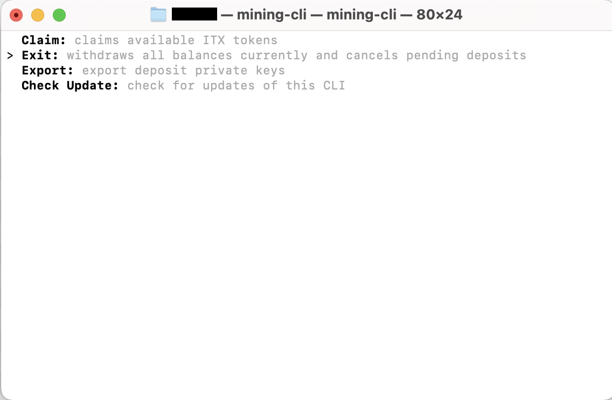

2. **Withdraw ETH To Withdrawal Address**:
Any pending deposit would be cancelled and all ETH balance will be withdrawn to your withdrawal address.

  

    

Note: If there are still ETH in your deposit address after this process, you can manually transfer ETH from deposit wallet to another wallet using the command below. Proceed by pressing any key as instructed by CLI.

### Exporting Deposit Private Keys

1. **Export**:
Select `Export`

  

    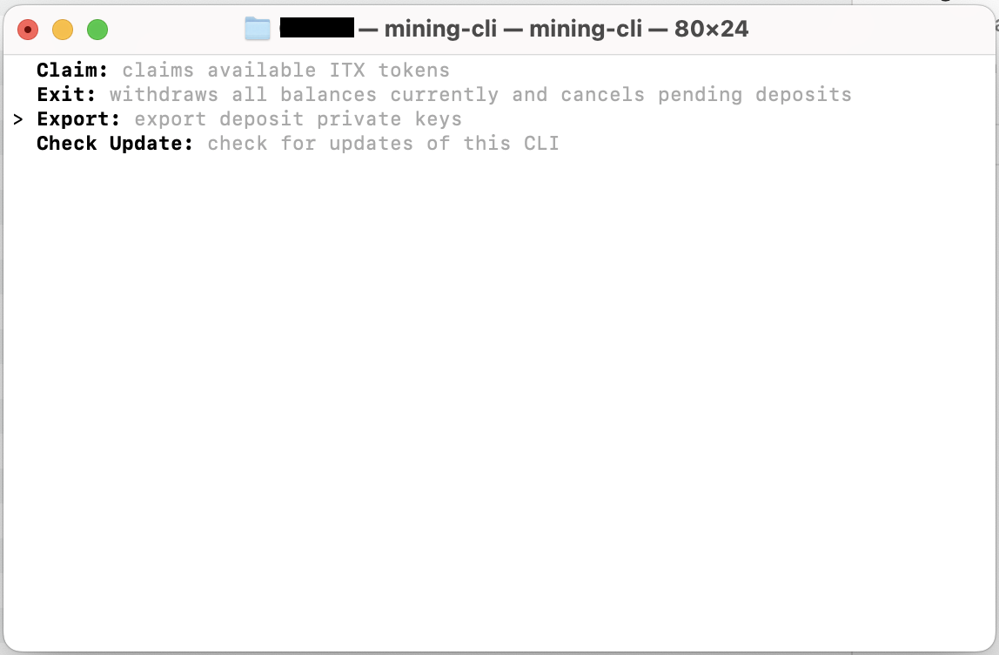

2. **Export Deposit Private Key**:
Copy private key and import account into metamask using this [guide](https://support.metamask.io/managing-my-wallet/accounts-and-addresses/how-to-import-an-account/).

  

    

3. **Transfer in CLI**:
To transfer ETH balance inside the CLI instead, type yes and select `#0` or your account of choice if you have several deposit accounts.

  

    

4. **Transfer ETH Balance**:
  Paste the address to transfer ETH balance to.
  

    

5. **Transfer in CLI**:
Approve transfer by typing `Yes`.
  

    

Repeat approval until ETH balance is insufficient. To end the process, press `Enter` key.

  

    

After withdrawal process is done, proceed by pressing any key as instructed by CLI.

### Check Available CLI Updates

1. **Select Mode**:
Select `Check Update` to check if you are using the latest version.
  

    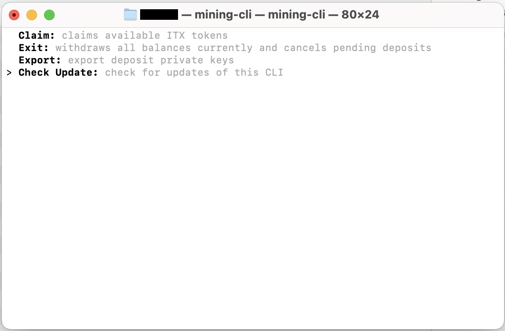

2. **Confirm CLI Version**:
Your current version should be same as the latest release to mine on Base. Navigate to the [Releases](https://github.com/InternetMaximalism/intmax2-mining-cli/releases) page of this repository to see the available latest version.

  

    

To continue with other modes, press `Enter` key on your keyboard.