## How to migrate from Mainnet to Base

This guide explains how to migrate from mining on the Ethereum Mainnet to Base the using the intmax2 mining CLI. The instructions below describe the process.

❗ Note: 
- The tokens you receive through mining on the mainnet currently cannot be transferred to other addresses, but this feature will be enabled in the future.
- Users who have initiated the 10 deposit process on Mainnet but haven't completed it should finalize it soon, as incomplete deposits will result in reduced allocations. 
- The mining process can take up to 6 days, and Mainnet mining will stop one week after the migration to Base. Please avoid making new deposits on Mainnet during this time.

🆘 Support: please join this with an anonymous account
https://discord.gg/nByKNNhyvn

## Prerequisites

Before you begin, please ensure you have the following:

- **Add Base Network To Your Wallet**: Refer to the Base [Network](./base.md) guide to add Base testnet and mainnet.
- **Your Alchemy API key enables Base Network**: Please refer to the [How to get your Alchemy API key](./alchemy.md) guide to ensure your API key supports Base Network.

## Step-by-Step Instructions

### Upgrading CLI Version

1.  **Lauching the CLI** Double-click on the mining-cli shown in this image to launch.

    

      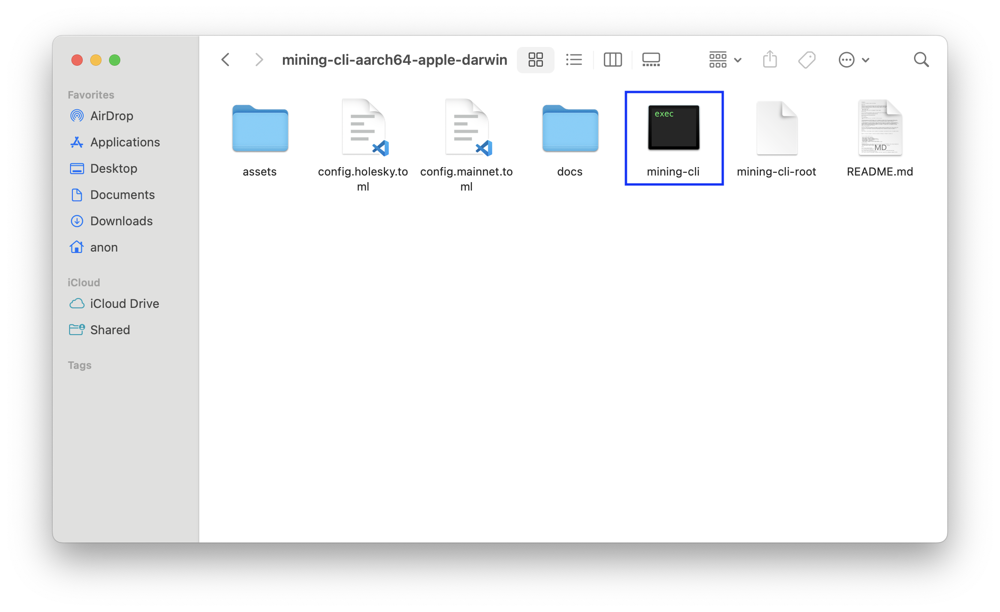

2.  **Update CLI**:
When you open the CLI, you'll see a screen like this:

   

     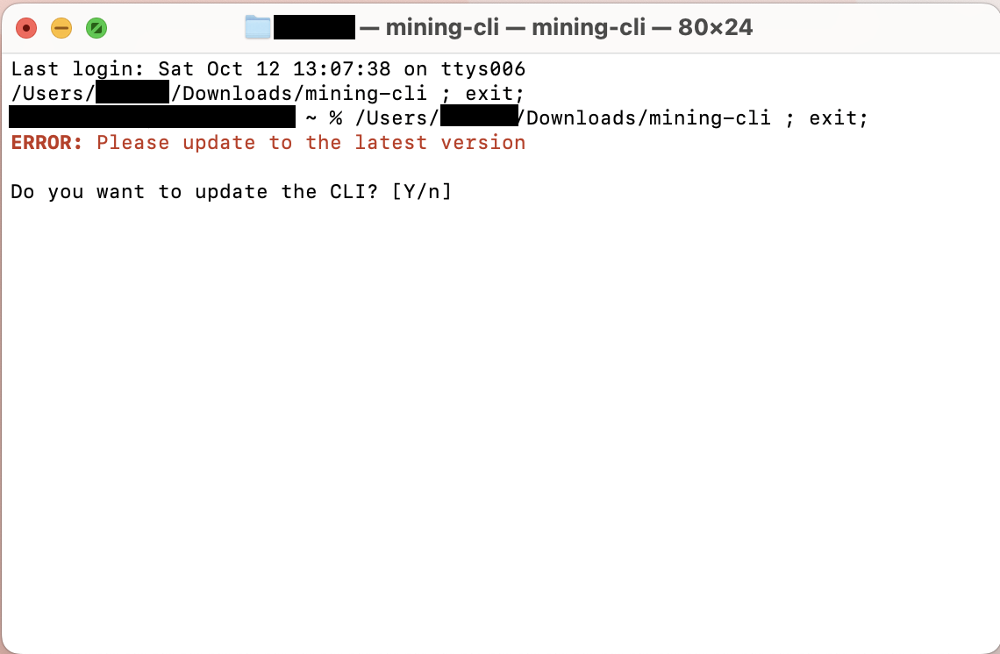

Press `Y` on your keyboard to select yes.

3.  **Continue Update**:
You'll see a screen like this:

   

     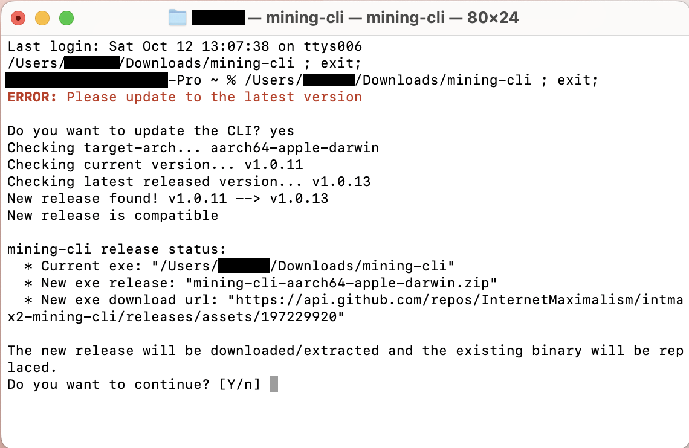

Press `Y` on your keyboard to select yes.

4. **Select Network**:
You can move the cursor with the arrow keys, select `mainnet` and press `Enter`.

   

     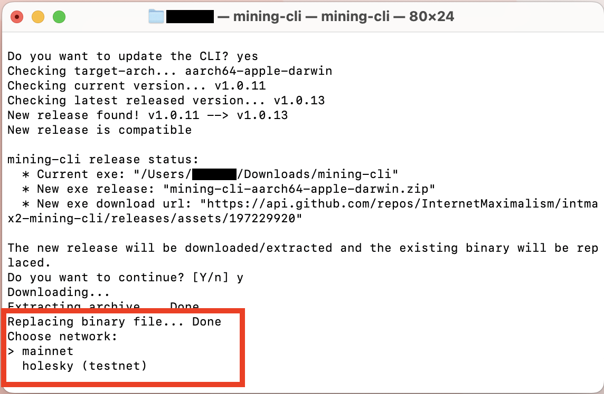

5. **Continue the process**:
   Select `Continue` to proceed with the previous settings.

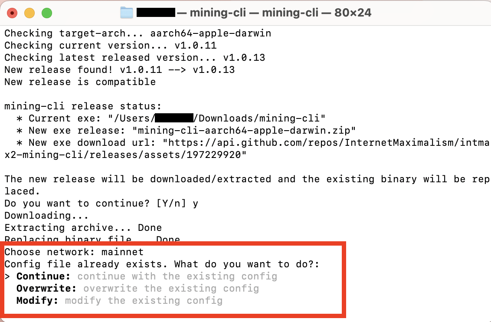

6. **Confirm Update**:
Before resuming mining, select `Check Update` to check if you are using the current version.
   

     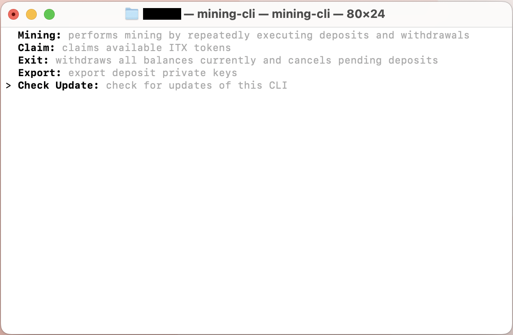

7. **Confirm CLI Version**:
Your current version should be same as the latest release to mine on Base. Navigate to the [Releases](https://github.com/InternetMaximalism/intmax2-mining-cli/releases) page of this repository to see the available latest version.

   

     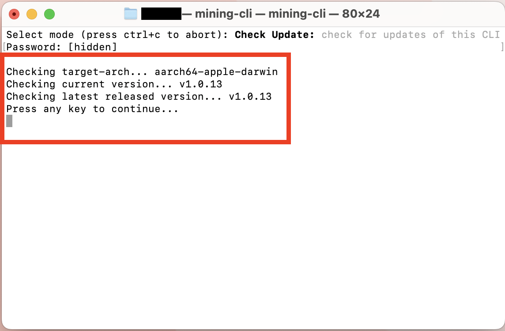

To continue, press any key on your keyboard(e.g, Enter).

### Mining
1. **Select Network**:
Mining has transitioned from Ethereum Mainnet to Base Network. Be rest assured that all your assets and ITX token are safe. To claim and retrieve the assets from Mainnet, select the next command.
   

     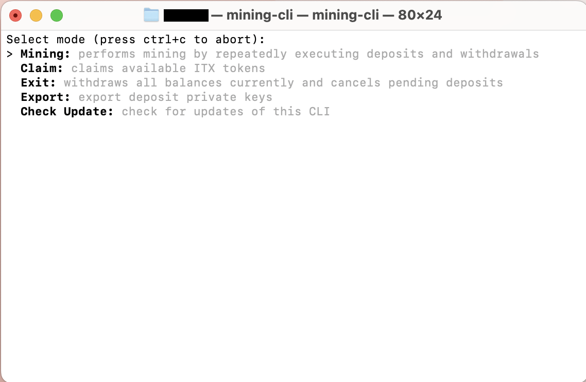

### Claiming ITX Tokens

1. **Claim ITX Token**:
To claim ITX token, select `Claim`. You can check whether an deposit address is eligible for rewards in the "Qualified" column after selecting the mode.

   

     

2. **Claim ITX Token To Withdrawal Address**:
If `Claim` was selected and your address qualifies for ITX tokens, the CLI automatically transfers your available ITX tokens to your withdrawal wallet immediately or when the token availablity time reaches. To see the tokens in your wallet, ensure to add the ITX mainnet token contract address to your wallet using the Network [guide](./holesky.md).

   

     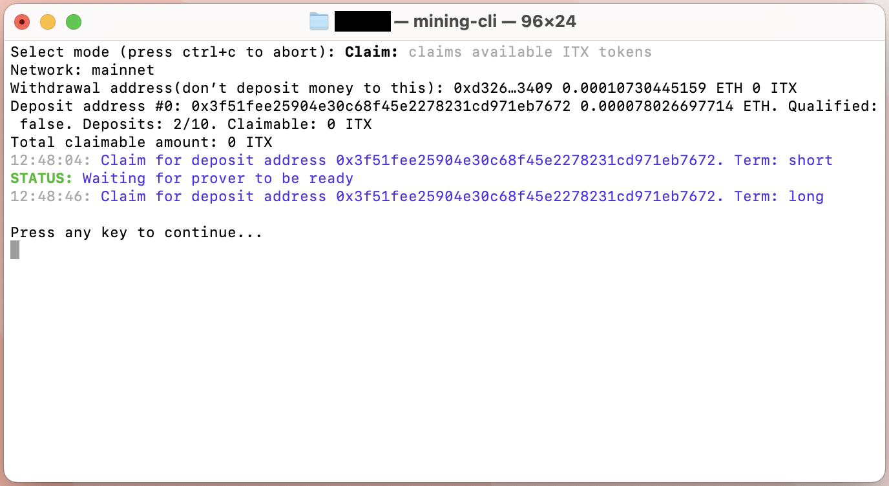

Check wallet to see tokens.

After claiming process is done, you can proceed to retreiving available ETH in the INTMAX2 Network back to your withdrawal address. Proceed by pressing any key as instructed by CLI.

### Withdraw ETH 

#### Important: Avoid making direct or indirect transfers between deposit and withdrawal addresses. Depositing in a withdrawal address will disqualify it from receiving rewards during mining. Please refer to the [README document](../README.md) for more information.

1. **Withdraw ETH**:
Select `Exit` to retrieve assets to withdrawal address.

   

     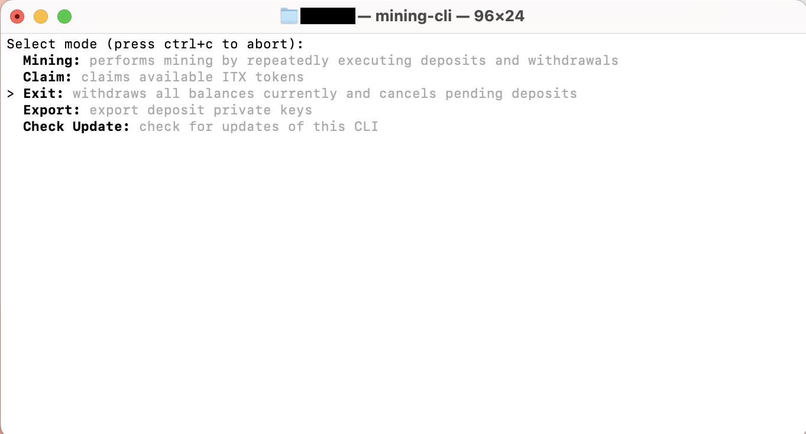

2. **Withdraw ETH To Withdrawal Address**:
Any pending deposit would be cancelled and all ETH balance will be withdrawn to your withdrawal address.

   

     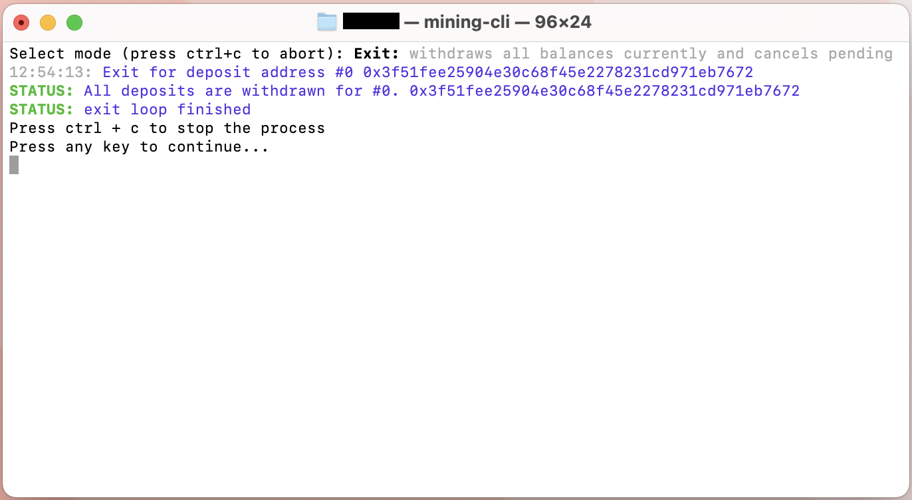

Note: If there are still ETH in your deposit address after this process, you can manually transfer ETH from deposit wallet to another wallet using the command below.

### Exporting Deposit Private Keys

1. **Export**:
Select `Export`

   

     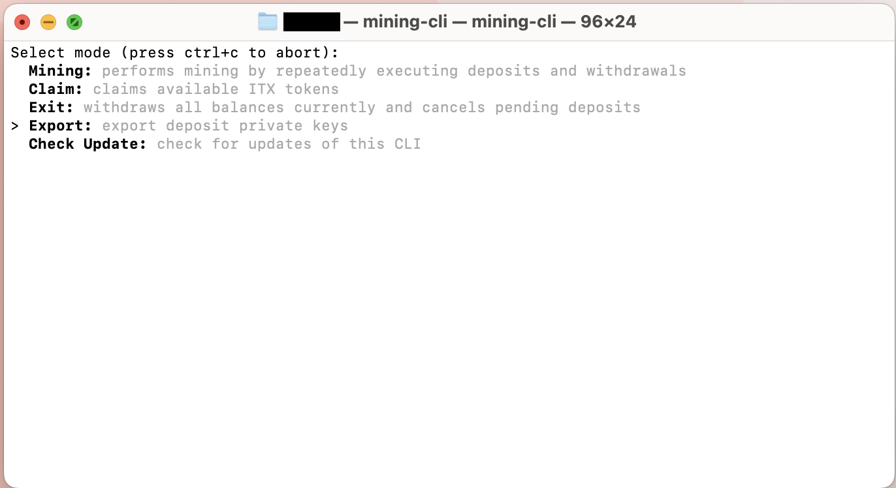

2. **Export Deposit Private Key**:
Copy private key and import account into metamask using this [guide](https://support.metamask.io/managing-my-wallet/accounts-and-addresses/how-to-import-an-account/).

   

     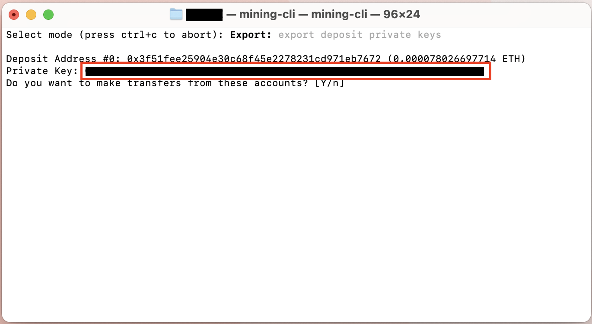

3. **Transfer in CLI**:
To transfer ETH balance inside the CLI instead, type yes and select `#0` or your account of choice if you have several deposit accounts.

   

     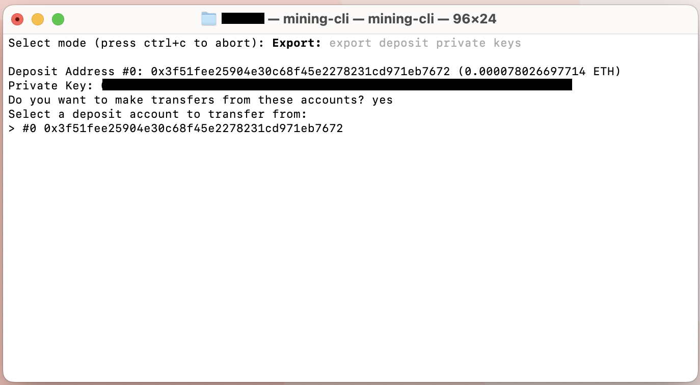

4. **Transfer ETH Balance**:
   Paste the address to transfer ETH balance to.
   

     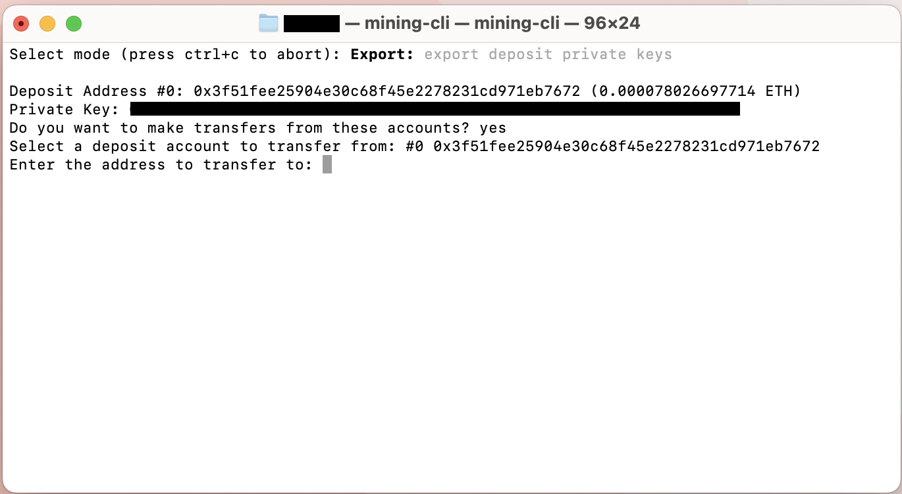

5. **Transfer in CLI**:
Approve transfer by typing `Yes`.
   

     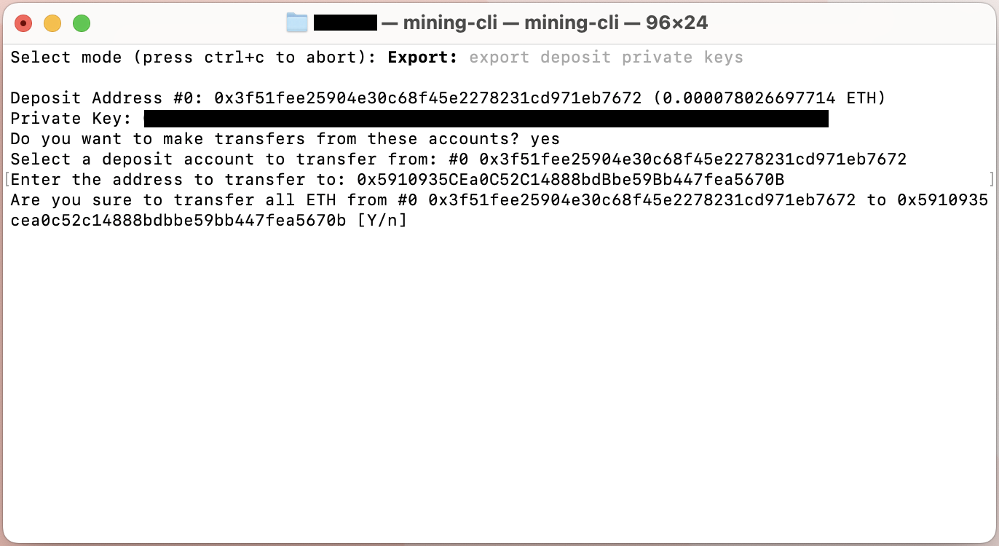

Repeat approval until ETH balance is insufficient. To end the process, press any key.
   

     

After withdrawal process is done, proceed by pressing any key as instructed by CLI.

