## Quick Start Guide For Holesky Testnet

This guide explains how to start mining on the Intmax network using the intmax2 mining CLI. While the instructions below describe the process for the Holesky testnet..

Note: The tokens you receive through mining on the mainnet currently cannot be transferred to other addresses, but this feature will be enabled in the future.

Support: please join this with an anonymous account
https://discord.gg/nByKNNhyvn

## Prerequisites

Before you begin, please ensure you have the following:

- **Ethereum (ETH)**: A minimum of 0.5 ETH for testnet plus additional ETH for gas fees. Please refer to the [Network](./holesky.md) guide to obtain testnet ETH.
- **Alchemy API key**: Please refer to the [How to get your Alchemy API key](./alchemy.md) guide to obtain your API key.
- **Withdrawal Private Key**: The private key of the address you'll use to withdraw ETH and receive ITX tokens.

## Download the CLI

1. Navigate to the [Releases](https://github.com/InternetMaximalism/intmax2-mining-cli/releases) page of this repository.
2. Download the ZIP file appropriate for your operating system.
3. Extract the contents of the ZIP file.

## Step-by-Step Instructions

### Starting the Mining Process

1.  **Lauchining the CLI** Double-click on the mining-cli shown in this image to launch.

    

      

> NOTICE: If you're using a Mac, you may see a message saying "Cannot be opened because the developer cannot be verified" as shown in the image. In that case, you need to change your Mac's security settings by referring to this link: https://support.apple.com/en/guide/mac-help/mh40616/mac

   

     

2. **Select Network**:
When you double-click the CLI, you'll see a screen like this:

   

     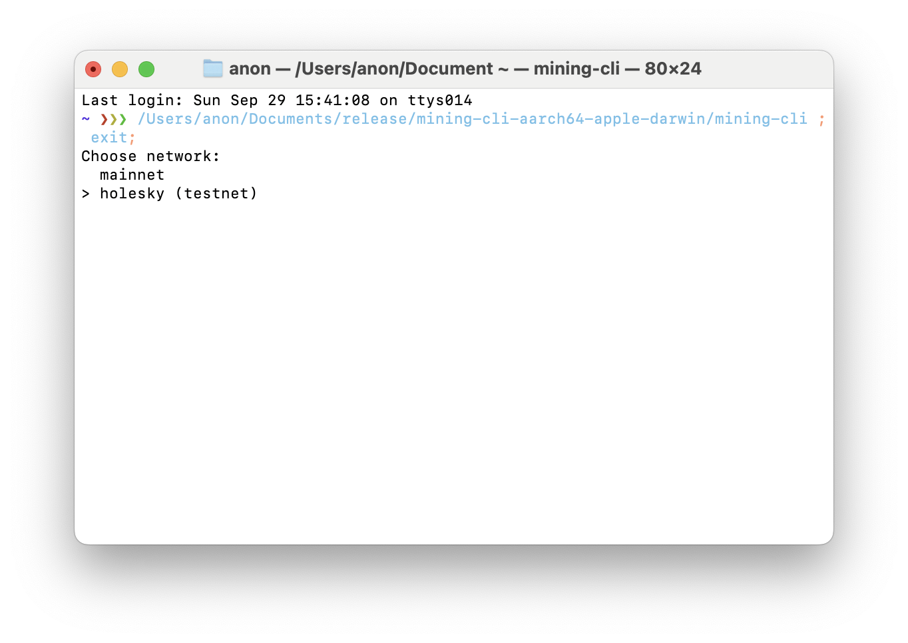

You can move the cursor with the arrow keys and confirm with `Enter`.
For this time, select `holesky (testnet)`.

3. **Enter Alchemy API key**: Select `Alchemy` and enter your API key which you obtained from [How to get your Alchemy API key](./alchemy.md) guide. Your API key will not be displayed. Press `Enter` after pasting it.

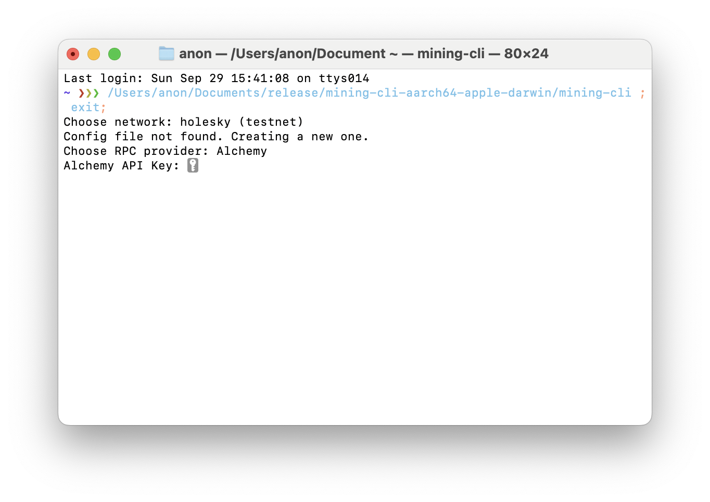

4. **Configure settings for the mining process**: Set `max gas price`, `mining unit`, and `mining times`. You can use the default values by pressing `Enter` or pressing `y`. You can also set your own values by pressing `n`, then entering the desired values. We recommend using the default values.

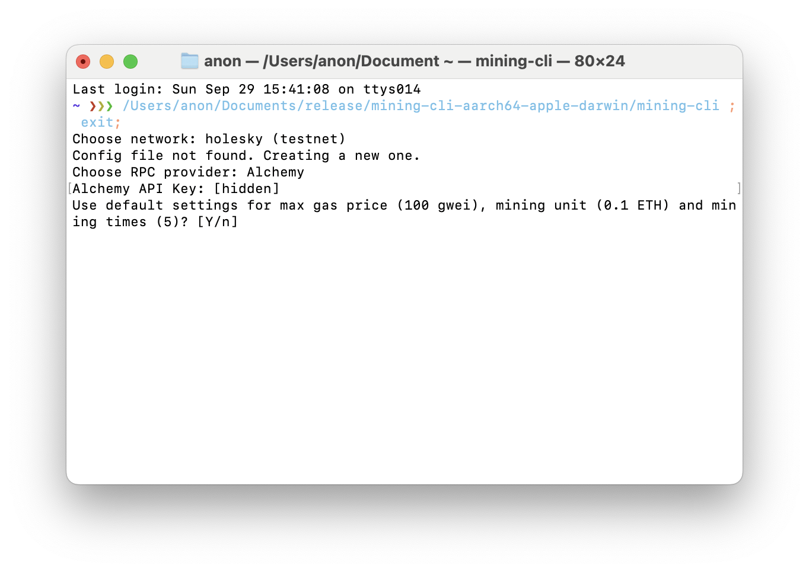

Here is the explanation of each setting:

- **Max Gas Price**: The maximum gas price allowed when executing transactions. Setting a higher value will cause undesirable funds loss.
- **Mining Unit**: The amount of ETH to send in one deposit. The default is 0.1 ETH.
- **Mining Times**: Specifies how many times to mine. The default is 10 times (for mainnet), 5 times (for testnet).

5. **Enter Withdrawal Private Key**: Enter the private key of the address you'll use to withdraw ETH and receive ITX tokens. Your withdrawal private key will not be displayed. Press `Enter` after pasting it.

After entering the withdrawal private key, the address will be displayed. Confirm that the address is correct.

6. **Choose whether to encrypt the private key**: Choose whether to encrypt the private key. Because the withdrawal private key will be stored in local storage, we highly recommend encrypting it. Press `y` or `Enter` to encrypt the private key, or `n` to store it in plain text.

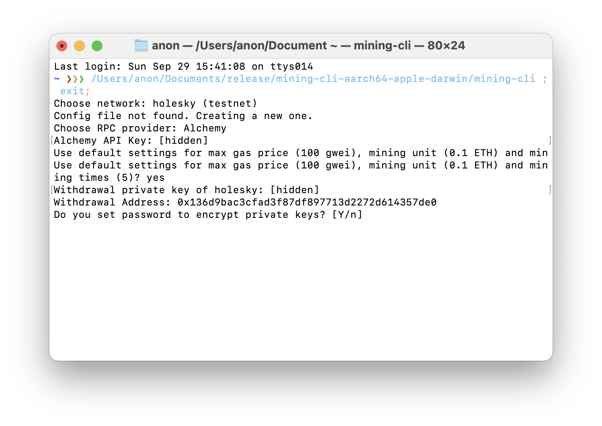

1. **Enter a password for the private key**: If you choose to encrypt the private key, you'll be asked to enter a password. Please enter a password of at least 12 characters.

8. **Select Mode**: Choose from the following modes using the arrows key: `Mining`, `Claim`, `Exit` or `Export`. For this time, select `Mining`.

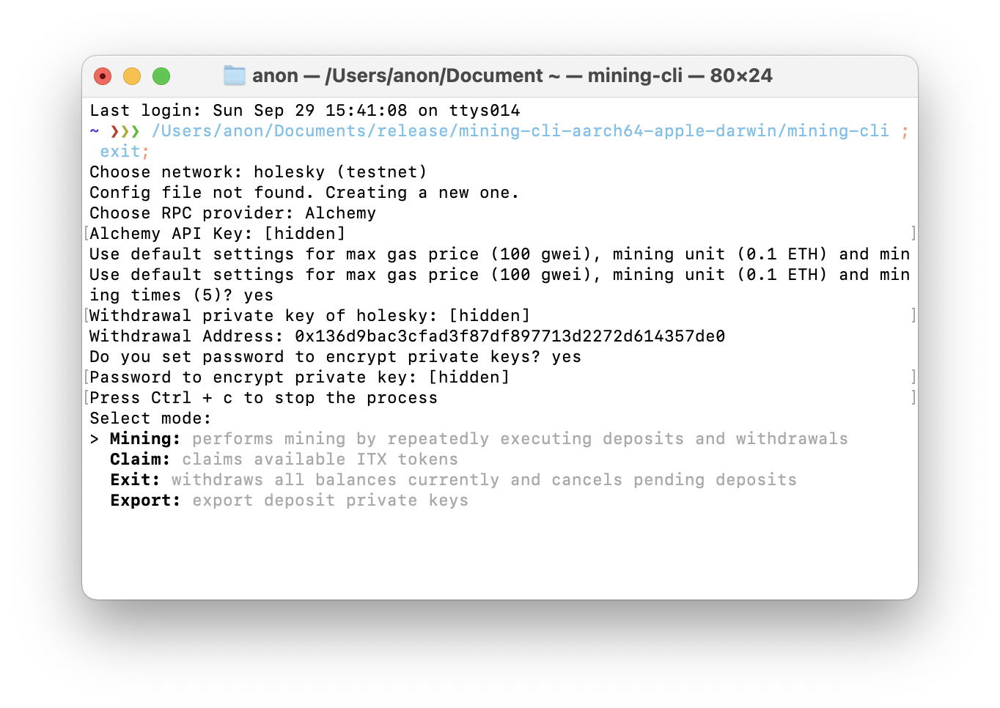

Here is the explanation of each mode:

- **Start Mining**: performs mining by repeatedly executing deposits and withdrawals
- **Claim**: claims available ITX tokens
- **Exit**: withdraws all balances in intmax2 and cancels pending deposits
- **Export**: exports the private key of the deposit addresses.

For this time, please select Mining.

1. **Deposit ETH to your deposit address**:

The mining process will begin.

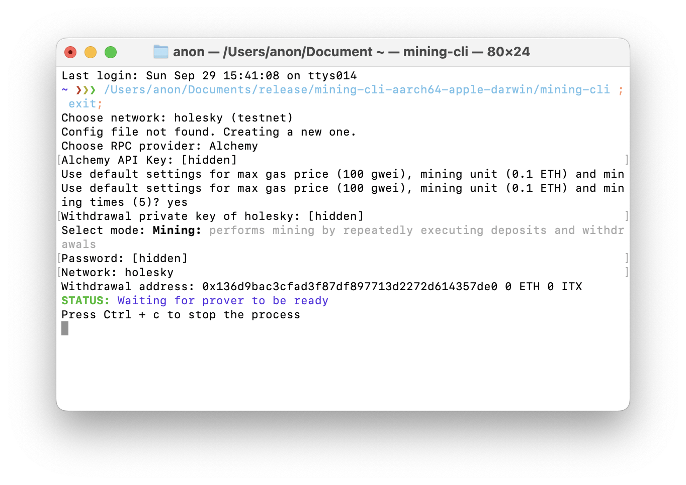

The CLI will generate a deposit address and display it. In the first time, the deposit account does not have any balance. CLI will display the required amount of ETH to deposit (equals to `(mining unit)*(mining times) + (gas fees for deposits)`). Please send the required amount of ETH to the deposit address.

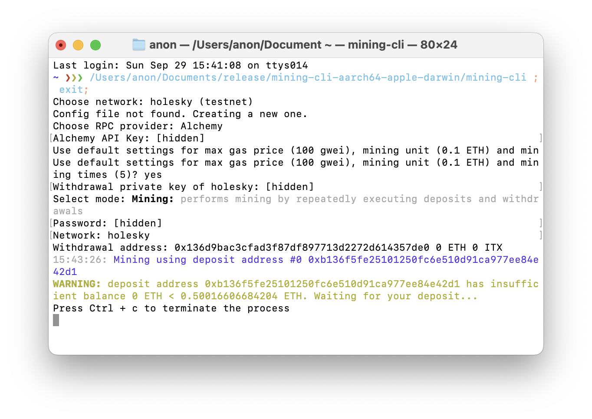

10. **Mining Process**:

CLI automatically deposits and withdraws ETH.

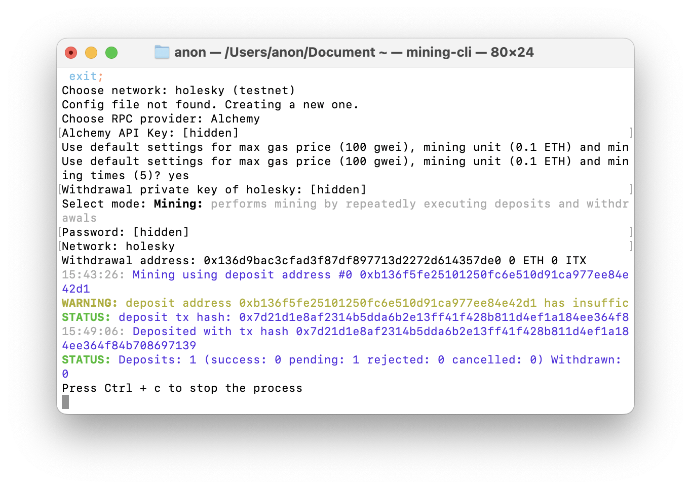

The mining process will pause if

- the balance of the deposit address is insufficient: please send ETH to the deposit address
- the network's gas price is higher than the max gas price setting: wait until the network's gas price drops or change the `max gas price` value.
- the number of `mining times` is reached: CLI will generate a new deposit address. Please send ETH to the new deposit address.

11. **Stop and Resume process**:

You can safely close the CLI window or press `ctrl + c` to stop the mining process. When you restart the CLI, you can resume the mining process by selecting `Mining` mode.

NOTE: If you stop the mining process when there is a balance in the intmax2, you can withdraw the balance by running in `Exit` mode, or you can continue the mining process by running in `Mining` mode.

### Claiming ITX Tokens

The deposits eligible for ITX tokens are confirmed at UTC 0:00 on the Monday two weeks after mining. After that, you claim ITX tokens.

1. **Select Network**:
Select `holesky (testnet)`.
   

     

2. **Continue the process**:
   Select `Continue` to proceed with the previous settings.

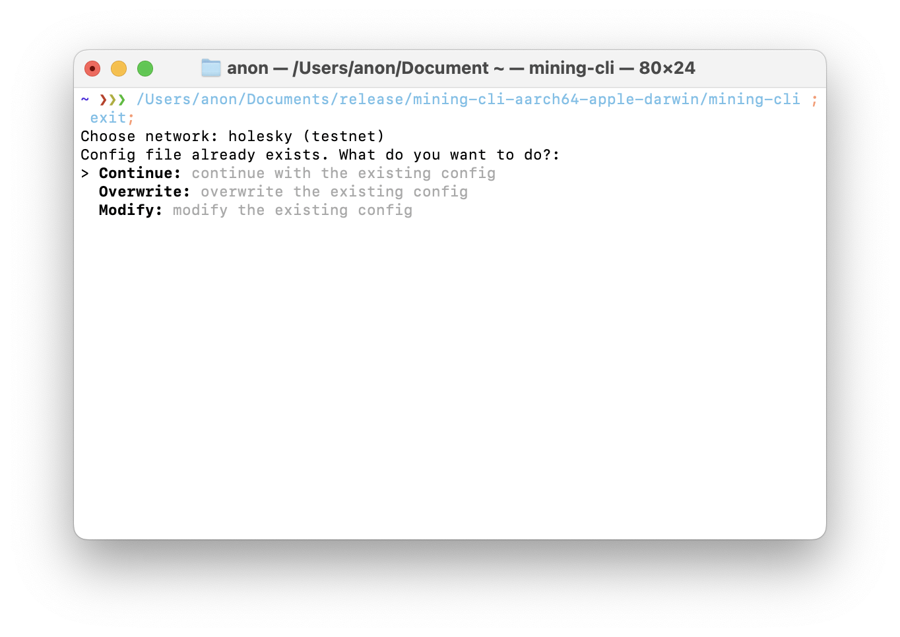

3. **Select Mode**:
   Select `Claim` mode. Then you will be asked password to decrypt the private key.
   
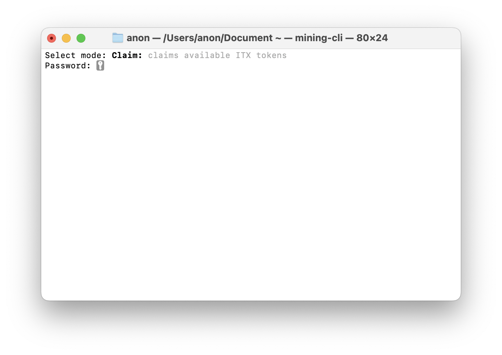

4. **Claim Process**:
   The Claim process will start. This process continues until there are no more ITX tokens available to claim. The ITX tokens will be sent to the withdrawal address.

### Exporting Deposit Private Keys

You can see the private keys of the deposit addresses. This is useful when you want to retrieve the balance of the deposit addresses.

1. **Select Network**:
Select `holesky (testnet)`.
   

     

2. **Continue the process**:
   Select `Continue` to proceed with the previous settings.

3. **Select Mode**:
   Select `Export` mode.
   

4. **Export**:
   The CLI will display the private keys of the deposit addresses. Please save them in a secure place.
   
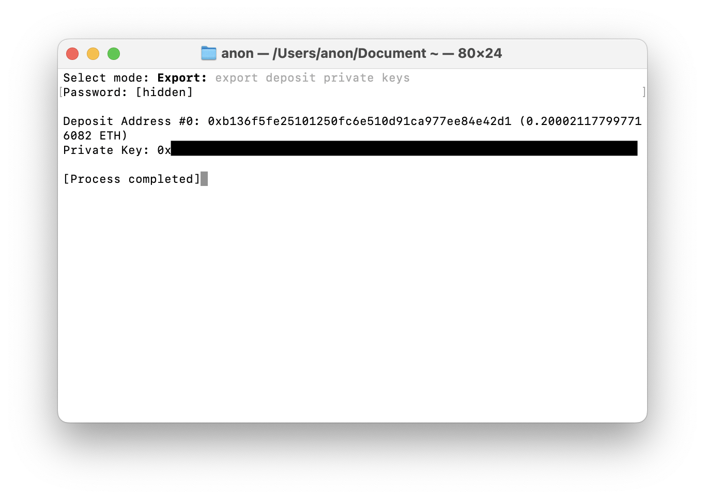

