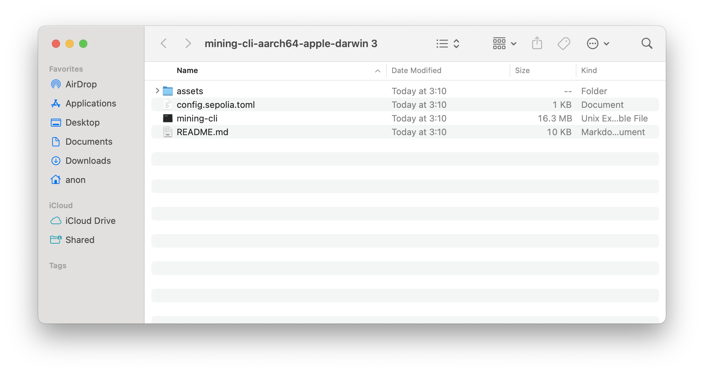
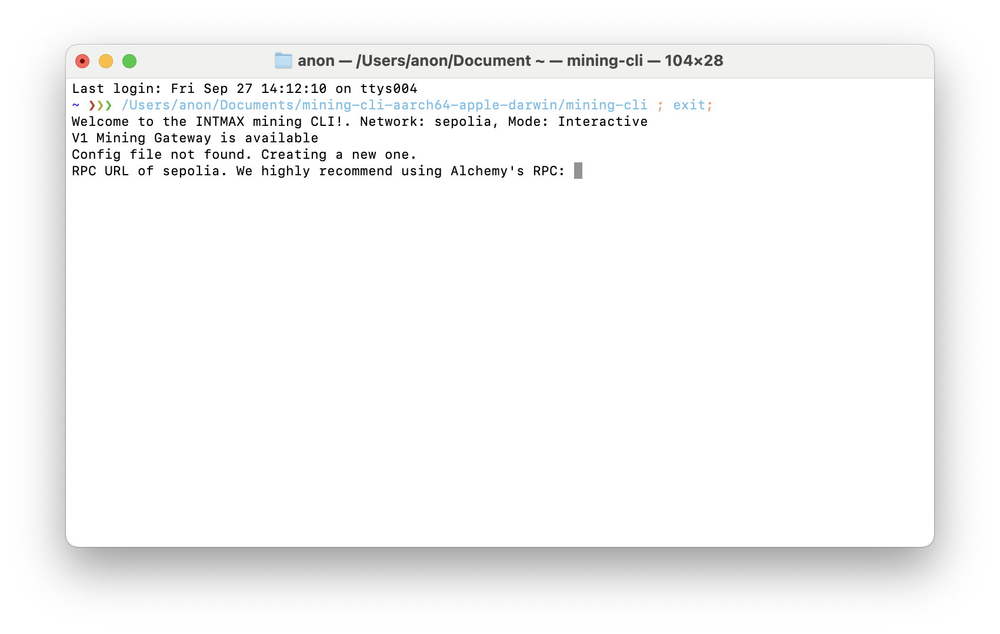
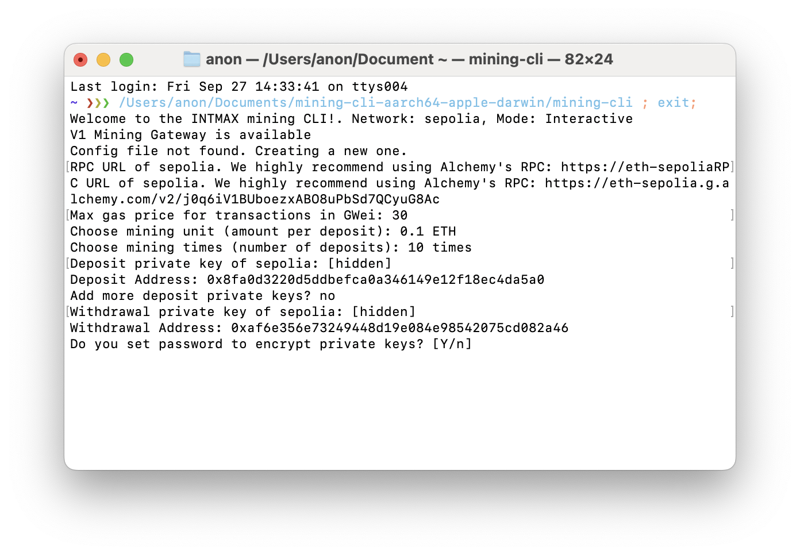
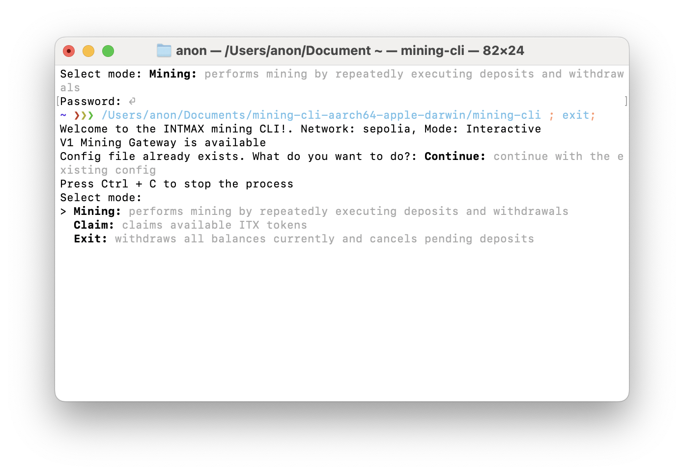
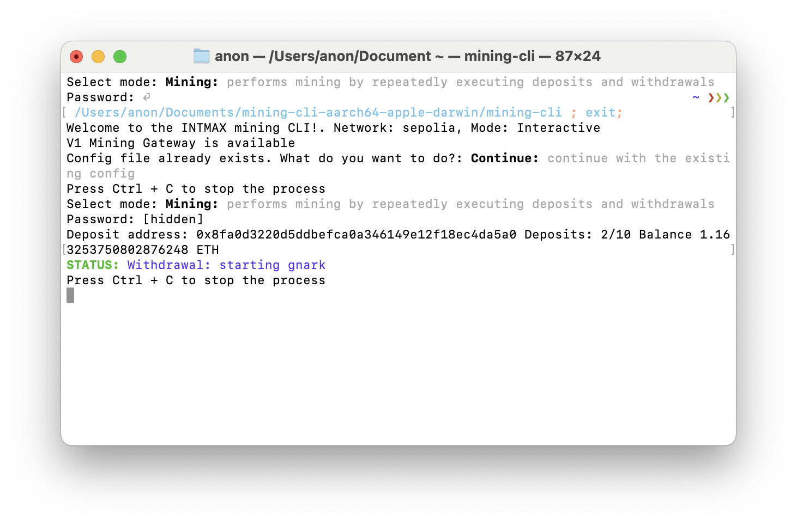
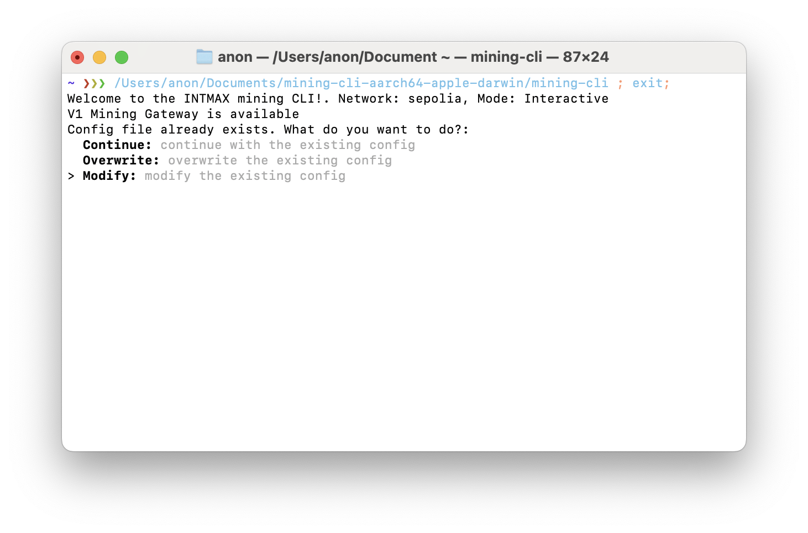
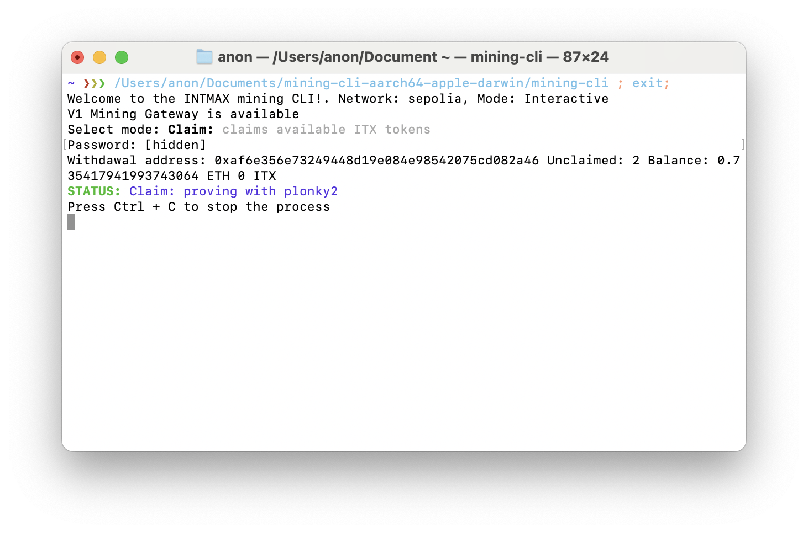

## Quick Start Guide

## Prerequisites

Before you begin, please ensure you have the following:

- **Ethereum (ETH)**: A minimum of 1 ETH plus additional ETH for deposit fees.
- **RPC URL**: We recommend using Alchemy's free plan. Sign up at [https://www.alchemy.com/](https://www.alchemy.com/)
- **Deposit Private Key**: The private key of the address you'll use to deposit ETH.
- **Withdrawal Private Key**: The private key of the address you'll use to withdraw ETH and receive ITX tokens.

## Installation and Setup

1. Navigate to the [Releases](https://github.com/InternetMaximalism/intmax2-mining-cli/releases) page of this repository.
2. Download the ZIP file appropriate for your operating system.
3. Extract the contents of the ZIP file to your desired location.

## Running the Application

1. Locate the extracted files and double-click on the executable file to launch the application.
2. Follow the CLI prompts to input the required information:

   - RPC URL
   - Deposit Private Key
   - Withdrawal Private Key
   - Other configuration options (as needed)

3. The application will guide you through the setup process and initiate the mining operation.

## Step-by-Step Instructions

### Mining

1. **Extract the ZIP file**: Extract the downloaded ZIP file to an appropriate location.

2. **Launch the Application**: Double-click on the executable file to open the CLI.
   Double-click on the mining-cli shown in this image to launch.

   

     

> NOTICE: If you're using a Mac, you may see a message saying "Cannot be opened because the developer cannot be verified" as shown in the image. In that case, you need to change your Mac's security settings by referring to this link: https://support.apple.com/en/guide/mac-help/mh40616/mac

   

     

3. **Enter Required Information**: Follow the prompts to enter the necessary information, such as the RPC URL, deposit private key, and withdrawal private key.

You can use default values for the following. If you don't enter anything and just press Enter in response to the question, the default value will be used.

- Mining unit: The amount of ETH to send in one deposit. The default is 0.1 ETH.
- Mining times: Specifies how many times to mine. The default is 10 times.
- Max gas price: The maximum gas price allowed when executing transactions. The default is 30 GWei. We recommend setting a larger value when running in environments with high gas prices, such as testnets.

   

     

1. **Enter password for private keys**
Set whether to encrypt and store your previously entered deposit private keys and withdrawal private key. Choose 'y' if you want to encrypt. We recommend encryption. Please enter a password of at least 12 characters.

   

     

NOTICE: If you forget your password, you won't be able to recover your deposit private keys or withdrawal private key. Make sure to backup your deposit private keys and withdrawal private key.

5. **Mode Selection**:
   Choose from the following modes:

- **Mining**: performs mining by repeatedly executing deposits and withdrawals
- **Claim**: claims available ITX tokens
- **Exit**: withdraws all balances currently and cancels pending deposits

  For this time, please select Mining.

     

6. **Start Mining**:

The mining process will begin.

     

However, the process will pause if the balance of the deposit address is insufficient or if the network's gas price is higher than the max gas price setting.

In the former case, please send ETH to the deposit address. In the latter case, wait until the network's gas price drops or change the max gas price value.

The mining process can be interrupted at any time with `Ctrl + c`. If you interrupt the mining process, the balance may remain in intmax2.
If you want to withdraw only the remaining balance in intmax2 without making a new deposit, select the `exit` mode to withdraw the balance. If you want to resume the mining process, run it again in `mining` mode.

The `mining` process automatically ends when it completes the set number of `mining times`.

7. **Using a new deposit address**:
   Since the number of times you can mine with one deposit address is limited, you need to use a new deposit address to continue mining.

Restart the CLI and select Modify. Press Enter until you see "Append deposit accounts?".
When "Append deposit accounts?" is displayed, enter 'y'.

     

Enter a new deposit private key.

### Claiming ITX Tokens

The deposits eligible for ITX tokens are confirmed at UTC 0:00 on the Monday two weeks after mining. After that, you can select the Claim mode to claim ITX tokens.

1. **Launch the CLI**
   When you double-click the CLI, you'll see a screen like this:

     

Here, select Continue.

2. **Mode Selection**:
   Select Claim mode.

   

     

3. **Claim Process**
   The Claim process will start. This process continues until there are no more ITX tokens available to claim.

     

