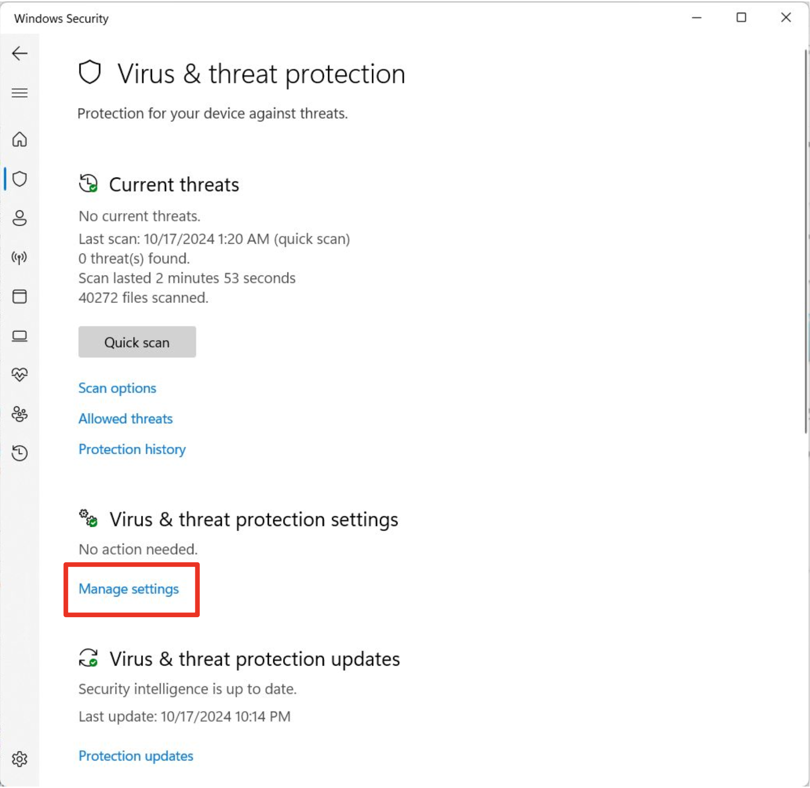
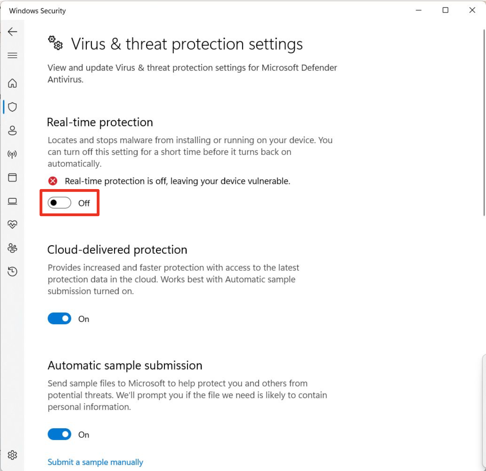
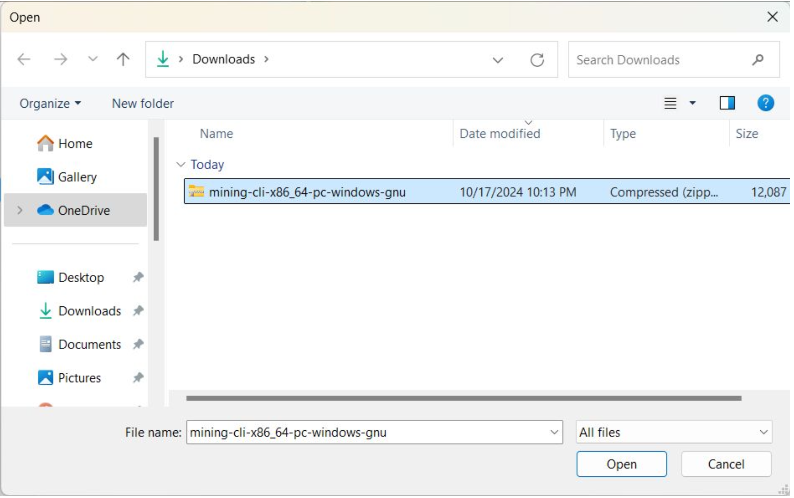
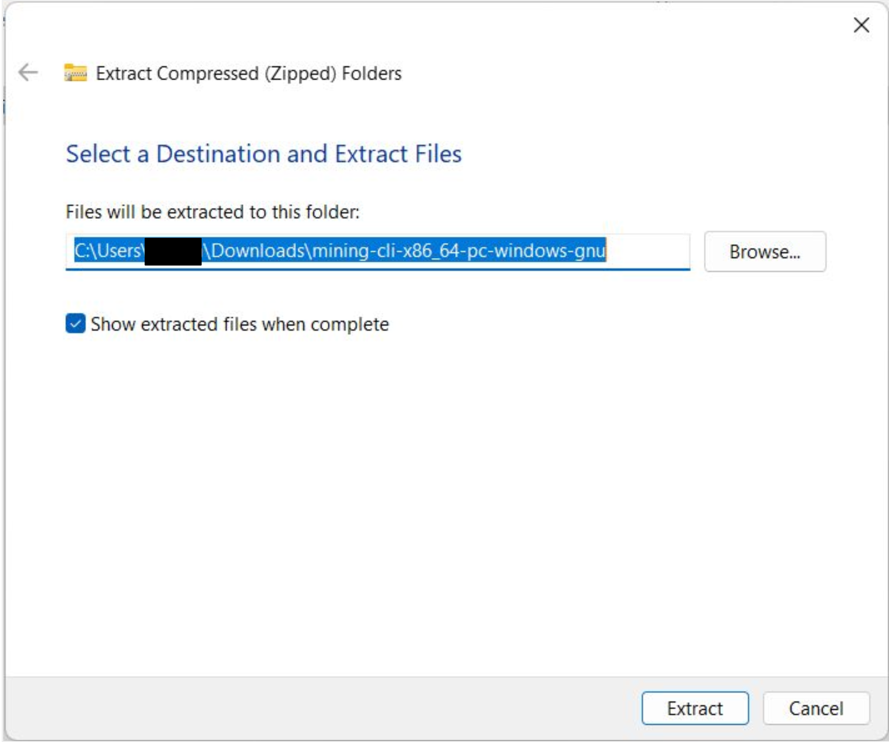
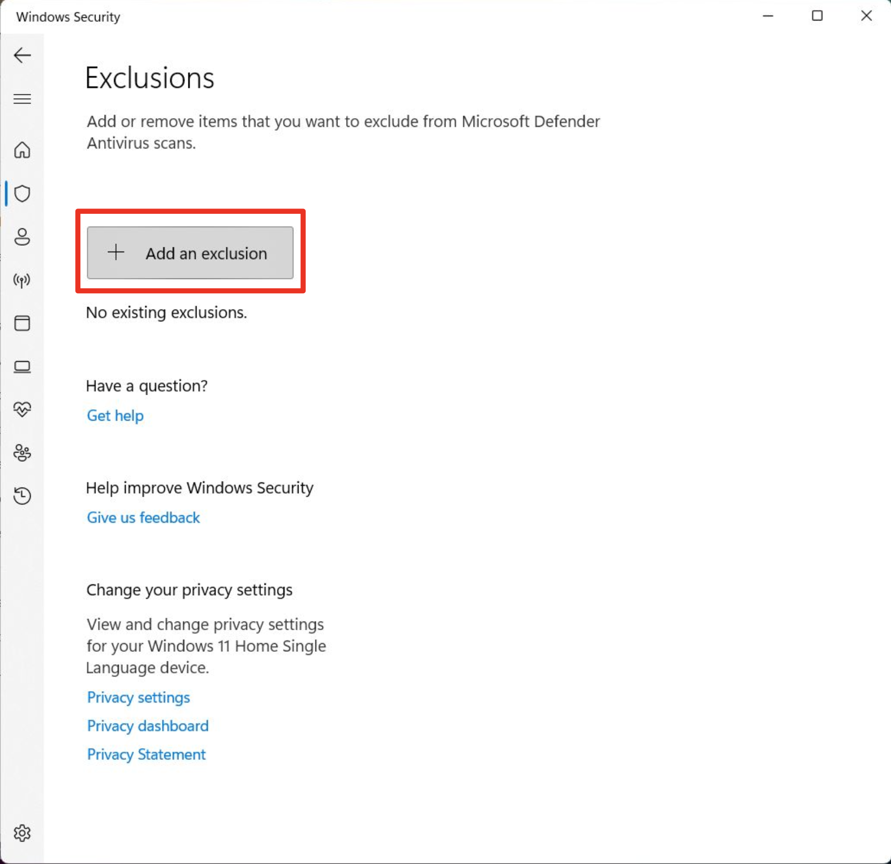
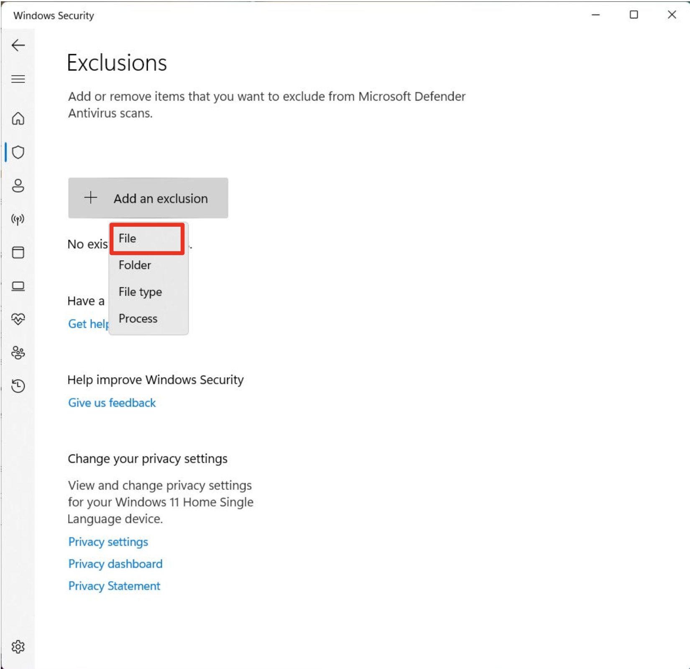
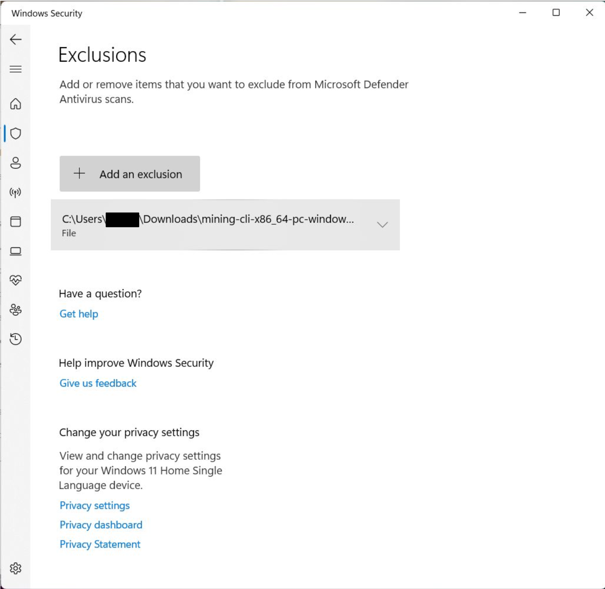
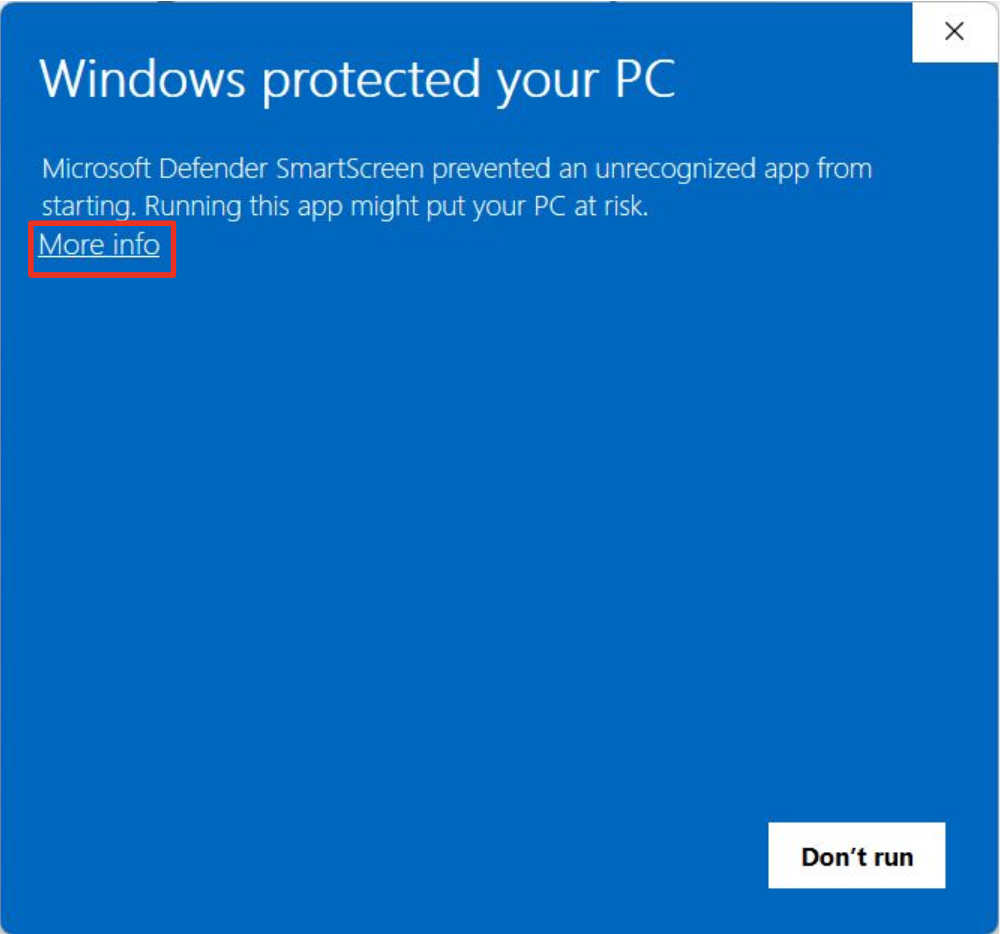
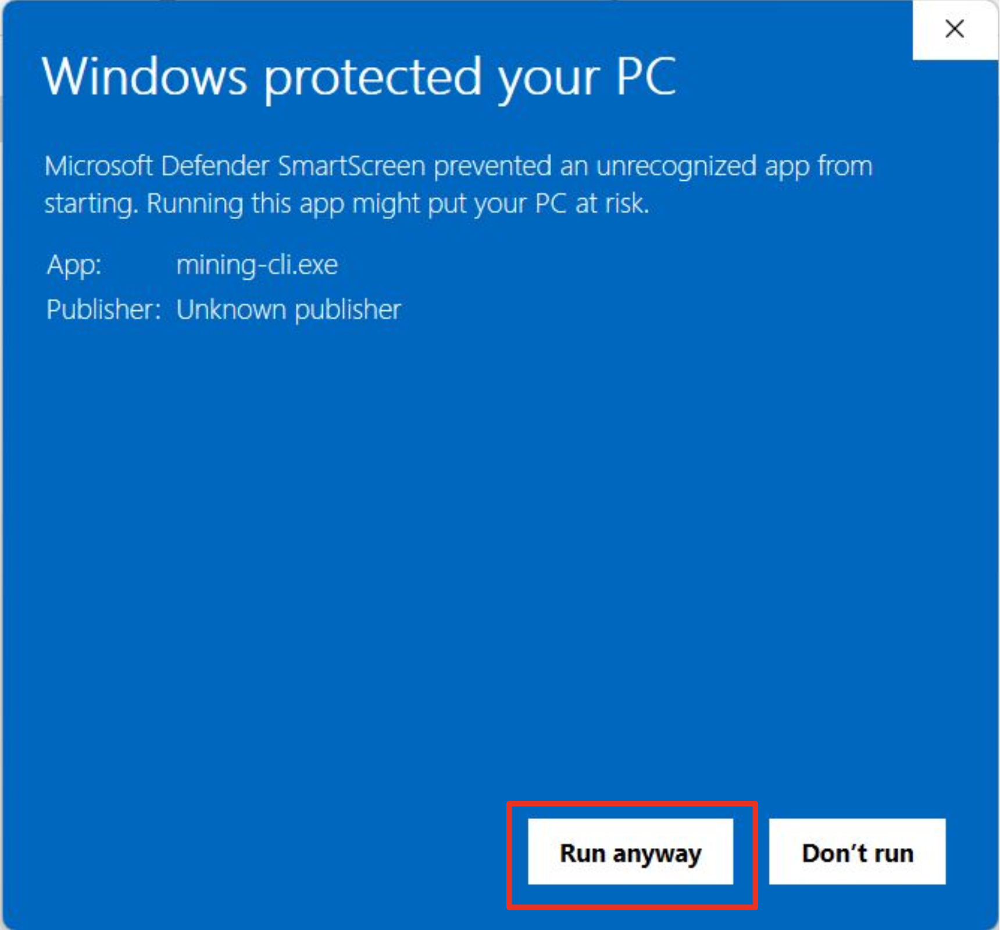

## Quick Start Guide For Setting Up On Windows PC.

Windows Defender offers strong protection against viruses and malware on Windows systems, but sometimes it can mistakenly flag legitimate programs, such as mining-cli.exe, as threats. 

If you encounter this issue, one quick way to resolve it is to temporarily disable Real-Time Protection while installing or running mining CLI. This guide will show you how to safely turn off real-time protection in Windows Defender, allowing you to install mining CLI without interruptions.

### Step-by-Step Guide
1. **Open Windows Security**: Click on the Start Menu (Windows icon in the lower-left corner of your screen) or press the Windows key on your keyboard. In the search bar, type `Windows Security`. Select *Windows Security* from the search results. This will open the Windows Security dashboard, which manages your system's security settings, including virus and threat protection.

2. **Access Virus & Threat Protection Settings**: Once inside the Windows Security dashboard, look for the option labeled *Virus & threat protection* and click on it. Scroll down within the *Virus & threat protection* page and find the Virus & threat protection settings section.Under this section, click on *Manage settings* to view and modify settings related to how Windows Defender scans and protects your system.malware-related settings.

3. **Turn Off Real Time Protection**: In the Virus & threat protection settings window, you’ll see a toggle switch under Real-time protection. This setting allows Windows Defender to continuously monitor your computer in real-time, but turning it off temporarily can help bypass false positives.

Click the toggle switch to turn Real-time protection Off. A warning message will appear stating that your device may be vulnerable. This is normal, and you can proceed since you’ll only disable it for a short period.

*Note: Real-time protection will automatically turn back on after some time, so you don't need to worry about forgetting to re-enable it.*

4. **Download And Install Mining CLI**: Navigate to the [Releases](https://github.com/InternetMaximalism/intmax2-mining-cli/releases) page of this repository. Download the ZIP file appropriate for Windows operating system. 

5. **Extract Mining CLI**: Extract the contents of the ZIP file to destination of choice on your PC.

6. **Add Exclusion for Mining CLI**: Scroll down in the Virus & threat protection settings window until you reach the Exclusions section. Click on *Add or remove exclusions* to open the exclusion management screen.

7. **Add an Exclusion**: In the Exclusions screen, click *Add an exclusion*. 

8. **Select The Mining CLI File**: A dropdown menu will appear with several options such as File, Folder, File type, and Process. Since you want to exclude the mining CLI file, select *File* from the dropdown menu.

9. **Exclusion**: A file explorer window will open, allowing you to navigate through your computer’s file system. Browse to the location where the mining CLI is installed. Select the mining CLI file and click "Select File" to add it to Windows Defender's exclusion list.

Double-check that the correct folder is listed by confirming the folder path. If the folder appears correctly, Windows Defender will no longer scan it or interfere with mining CLI.

Double click the mining CLI to run as you normally would after adding the exclusion. 

10. **Approve The Mining CLI**: If an error screen pops up like the picture below. Click on *More info* in the prompt screen that pops up.

11. **Runing The Mining CLI**: Windows Defender will proceed to show file name and publisher. Scroll down the screen and select *Run anyway*.

12. **Re-enable Real-Time Protection**:Once you’ve successfully installed or used the mining CLI, it's important to turn Real-time protection back on to safeguard your system.
Return to the Virus & threat protection settings window (follow Step 1 and Step 2). 

Click the toggle switch to turn Real-time protection On again. This will reactivate Windows Defender's continuous protection and keep your system secure.

You may now proceed to begin mining activities on [base mainnet](./base_mainnet_quickstart.md) or [base sepolia testnet](./base_sepolia_quickstart.md).